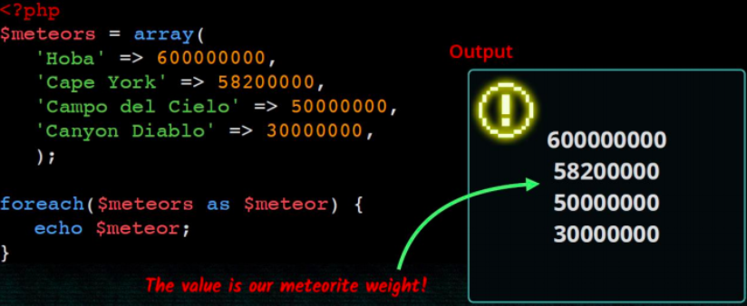

# 3. Maneig d'arrays

## Introducció

Un array és un tipus de dades que ens permet emmagatzemar diversos valors. Per tal d'accedir a un valor utilitzarem una *clau*. Les claus poden ser nombres o textos (*arrays associatius*). Si no indiquem cap clau, a cada element se li associarà una clau numèrica correlativa.

## Array indexat

### Crear array

* Podem crear un array buit de dues formes:

```php
$noms = array();
$noms = [];
``` 

* Si volem assignar valors al array en el moment de crear-ho: 

```php
$noms = array('Sandra', 'Pedro', 'Andrea'); 
$noms = ['Sandra', 'Pedro', 'Andrea'];
```

### Mostrar el contingut d'un array

Si intentem mostrar el contingut d'un array amb **echo** no obtindrem  les dades que hi ha dins del array. En lloc d'açò podem utilitzar la funció print_r: 

```php
print_r($noms);
```

Però si necessitem donar-li format als continguts del array, haurem de recórrer-ho amb un bucle i anar mostrant element a element.

### Afegint elements al array

Podem afegir elements al array utilitzant claudàtors buits. La clau d'aquests elements serà el següent índex numèric disponible.

```php
$noms[]='Raul'; $noms[]='Marta';
```

### Accedir als elements del array

Accedirem als elements del array indicant la clau de l'element entre claudàtors:

```php
echo $noms[2];
```

 També podem modificar el seu valor:

```php
$noms[0] = 'Sara';
```
### Recórrer arrays


## Arrays associatius

Si el array conté dades diverses i/o ens interessa accedir a ells amb claus més específiques que un simple índex numèric podem utilitzar arrays associatius: 

```php
$alumne = array('nom' => 'Sara', 'cognom' => 'García', 'edat' => 22 );
$alumne = ['nom' => 'Sara', 'cognom' => 'García', 'edat' => 22 ];
$alumne['nom'] = 'Verónica';
echo $alumne['nom'];
```
### Recórrer arrays associatius



### Recórrer claus i valors


## Arrays multidimensionals
Imagina que volem tenir un array els elements del qual són noms d'esports. Volem dividir-los en esports d'hivern i esports d'estiu. Podem crear un array esports que continga dos elements que al seu torn també seran arrays.

```php
$esports = ['hivern' => ['esquí de fons', 'hoquei sobre gel'], 'estiu' => [ 'natació', 'voley platja'] ];
```

Per a accedir al primer esport d'hivern:

```php
echo $esports['hivern'][0];
```

## Funcions d'arrays

Podem obtenir la mida de l'array mitjançant la funció count (array). 
Per recórrer l'array farem ús d'un bucle `for`:

```html+php
$tam = count($fruites); // mida de l'array
for ($i=0; $i<count($fruites); $i++) {
   echo "Element $ i: $ fruites [$ i] <br />";
}
```

Les operacions més importants que podem realitzar amb _arrays_ són:

* `print_r($ array)`: mostra el contingut de tot el `$array`
* `$elem = array_pop($array)`: elimina l'últim `$element`
* `array_push ($ array, $ elem)`: afegeix un `$element` al final.
* `$bool = in_array($elem, $array)`: esbrina si `$elem` està en el`$array`

=== "PHP"

    ```php    
    $fruits = [ "orange", "pear", "apple"];

    array_push ($fruites, "pinapple");
    print_r($fruits);

    $lastFruit = array_pop($fruits);
    if (in_array("pineapple", $fruits)) {
        echo "<p> Pineapple left </ p>";
    } else {
        echo "<p> No pineapple left </ p>";
    }
    print_r($fruites);
    ?>
    ```

=== "Consola"

    ```Console
    Array
    (
      [0] => orange
      [1] => pear
      [2] => apple
      [3] => pinapple
    )
    <p>No pineapple left</ p>
    Array
    (
      [0] => orange
      [1] => pear
      [2] => apple
    )
    ```

* `$claus = array_keys($array)`: torna les claus de l'`$ array` associatiu.
* `$tam = count ($array)`: retorna la mida de `$ array`.
* `sort($array)`: ordena els elements de l' `$ array`.
* `isset($array[element])`: indica si existeix / té valor element dins del array.
* `unset($array[element])`: elimina l'element de l'array (deixa un buit).

=== "PHP"

    ```php
    $capitals = array ( "Italy" => "Rome",
    "France" => "Paris",
    "Portugal" => "Lisbon");

    $countries = array_keys ($ capitals);
    print_r($countries);
    sort($countries);
    print_r($countries);
    
    unset($capitals["France"]);
    print_r($capitals);
    ?>
    ```

=== "Consola"

    `` `Console
    Array
    (
      [0] => Italy
      [1] => France
      [2] => Portugal
    )
    Array
    (
      [0] => France
      [1] => Italy
      [2] => Portugal
    )
    Array
    (
      [Italy] => Rome
      [Portugal] => Lisbon
    )
    `` `

Existeixen moltíssimes més funcions per treballar amb arrays. Tota la informació en el [documentació oficial](https://www.php.net/manual/es/ref.array.php).

!!! tip "Articles per aprofundir en les operacions amb arrays"
    * Un article molt complet (en anglès) de [Com treballar amb arrays en PHP de la manera correcta](<https://code.tutsplus.com/tutorials/working-with-php-arrays-in-the-right-way-cms-28606).
    * Un altre article recomanable (en anglès) és [Com ordenar arrays en PHP](https://code.tutsplus.com/tutorials/wow-to-sort-arrays-in-php--cms-32313).

Altres recursos: 

* [https://www.studytonight.com/php/indexed-array](https://www.studytonight.com/php/indexed-array)
* [https://aprende-web.net/php/php6_1.php](https://aprende-web.net/php/php6_1.php)

## Activitats

### Activitat 231: Arrays indexats

Crea una pàgina anomenada `arrays.php`, copia el contingut de la pàgina `index.php` i resol els exercicis següents 
utilitzant funcions d'arrays:

1. Crea un array amb els noms de diversos alumnes de la classe incloent el teu. 
2. Mostra el nombre d'elements que té l'array (_count_). 
3. Crea una cadena de text que continga els noms dels alumnes existents en l'array separats per un espai i 
mostra-la (_implode_).
4. Mostra l'array en un ordre aleatori diferent al que ho vas crear (_shuffle_). 
5. Mostra l'array ordenat alfabèticament (_sort_). 
6. Mostra els alumnes el nom dels quals continga almenys una “a” (_array_filter_).
7. Mostra l'array en l'ordre invers al que es va crear (_rsort_). 
8. Mostra la posició que té el teu nom en l'array (_array_search_).

### Activitat 232: Arrays associatius

Segons l'INE les 7 ciutats més grans d’Espanya (per habitants) el 2018 van ser les següents:

- Madrid, MAD,	3.223.334
- Sevilla, AN	, 688.711
- Murcia, MU,	447.182
- Málaga, AN,	571.026
- Zaragoza, AR, 666.880
- València, CV,	 791.413
- Barcelona, CAT, 1.620.343

Copia `index.php` i crea un nou document `cituats.php`. Defineix un array que continga aquesta informació sobre ciutats i 
habitants. Imprimeix una taula d'ubicacions i habitants que incloga la població total de les 7 ciutats.

Opcional:
Modifica la solució de l’anterior exercici perquè mostre les ciutats ordenades per habitants. Després mostra-les per ordre alfabètic.


### Activitat 233: Arrays multidimensionals

Crea una pàgina anomenada `arrays2.php`, copia el contingut de la pàgina index.php i resol els exercicis següents utilitzant funcions d'arrays: 

1. Crea un array d'alumnes on cada element siga un altre array que continga nom i edat de l'alumne. 
2. Crea una taula HTML en la qual es mostren totes les dades dels alumnes. 
3. Utilitza la funció `array_column` per a obtenir un array indexat que continga únicament els noms dels alumnes i 
mostra’ls per pantalla. 
4. Crea un array amb 10 números : 
   * utilitza la funció `array_sum` per a obtenir la suma dels 10 nombres. 


### Activitat 234: Opcional

Modifica la solució del exercici `ciutats.php` perquè la taula continga també la columna del total d’habitants de la 
comunitat autònoma de les ciutats de la llista i el percentatge sobre els habitants de la comunitat autònoma que representa.


Per exemple: 

| Ciutat | Habitants | Habitats CA | % sobre CA |
| -- | --: | --: | --: | 
| València | 791.413 |  5.003.769 | 15.81% | 

Pista: Caldrà modificar l'array  `$ciutats` i convertir-lo en multidimensional. Les dades de comunitats autònomes hauran
d'estar en un altre array. 

Dades: [Municipis de España](https://es.wikipedia.org/wiki/Anexo:Municipios_de_Espa%C3%B1a_por_poblaci%C3%B3n)