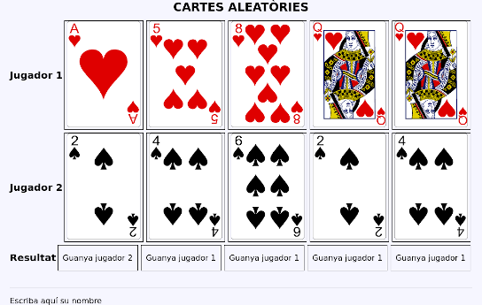

# Activitats

## POO Bàsic

301. `301-Card`: Crea una classe anomenada `Card` que contindrà la informació
     relativa una carta de la baralla francesa amb les seguents propietats:

     * `suit`, string, privada.
     * `symbol`, string, privada.
     * `value`, entera, privada.

     El constructor i el seus _getters_ i _setters_.

     Crea cinc objects diferents en un array i mostra'ls de forma aleatòria. 

     ```mermaid
     classDiagram
     class Card {
         -string suit
         -string symbol
         -int value
         +void function __construct (string, string, int)
     } 
     ```
    
302. `302-CardCollection`: Crea una classe anomenada `CardCollection` que contindrà la propietat
     `cards` que serà un array de cartes (objectes `Card`).

     Hi haurà dues formes d'inserir cartes, mitjançant el mètode `CardCollection::add(array $array)` que rebrà un array de cartes i els afegirà a la propietat `cards` i el mètode `CardCollecion::addCard(Card $card)` que rebrà una carta i la inserirà en la propietat `card`.

     A més, contindrà el mètode `shuffle()` que ordenarà les cartes de forma aleatòria.

     Instància la classe, afig 5 cartes, reordena-les i mostra-les.

     ```mermaid        
     classDiagram
     class CardCollection {
          -cards: array
          +add(cards: array)
          +addCard(card: Card): void
     }
     class Card {
         -suit: string
         -symbol: string
         -value: int
         __construct (suit: string, symbol: string, value: int)
         shuffle()
         getCards() array
     } 
     CardCollection "1"--"*" Card
     ```
            
303. `303-writer`: crea el mètodo `writer` en la classe `CardCollection` de forma que mostre en format lliure la   col·leció de cartes. Amb aquest mètode afegirem una nova capa d'abstracció ja que no caldrà accedir directament als mètodes de la classe `Card`.  Afig un segon mètode que mostre la col·lecció de cartes en una imatge que represente cada carta (les imatges que hem usat en activitats anteriors).

304. `304-basic-game`: fent ús de les classes anteriors crearem una aplicació bàsica en la que s'enfronten dos jugadors. Un exemple de partida podria ser el següent:

    

    La classe `CardCollection` quedarà així:

     ```mermaid        
     classDiagram
     class CardCollection {
          -cards: array
          add(cards: array)
          addCard(card: Card) void
          ...
          deal(amount: int) array
          play() Card
     }

     ```
    
    Els requisits seran els següents:

    1.  Es repartiran 5 cartes per jugador.
    *  El mètode `deal` que repartirà el número de cartes que s'indique com a paràmetre eliminant-les de la col·lecció.
    *  El mètode `play` jugarà una carta que s'eliminarà de la col·lecció.
    *  Cada tirada la guanya el jugador que té la carta més alta, segons el valor.
    *  La partida la guanya el jugador que ha guanyat més vegades.
    *  En cas d'empat es repartirà una nova carta a cada jugador.
    
    Així que en la aplicació interactuaran 3 objectes de tipus `CardCollection`.

305. `305-abstract-game`: en l'activitat anterior vam crear tres objectes de tipus `CardCollection`.  Podem observar que alguns mètodes, com per exemple `deal` (_repartir_) tenen sentit en l'objecte quan representen la mà d'un jugador.

     Podem replantejar la solució de la següent manera:


     ```mermaid

     classDiagram
          direction LR
          class CardCollection {     

               << abstract >>
               #cards: array
               +add(cards: Card[])
               +addCard(card: Card) void
               getCards() Card[]
          }
     
          class Card {
              -suit: string
              -symbol: string
              -value: int
              __construct (suit: string, symbol: string, value: int)
     
          } 

          class Deck {                    
               shuffle()
               deal(amount: int = 1) Card[]
          }

          class Hand {                    
               play() Card
          }

          CardCollection "1"--"*" Card
          Deck --|> CardCollection
          Hand --|> CardCollection        
     ```

     En el diagrama anterior definim `CardCollection` com una classe abstracta, d'ella hereten dos classes `Deck` que representa la baralla i `Hand` que representa les cartes d'un jugador. Cada classe exten la funcionalitat afegint els seus propis mètodes.

     Recorda que una classe abstracta és un tipus de classe que no s'instància i sols poden ser heretades traslladant així un funcionamient obligatori a les classes filles (o subclasses). 

     Modifica la solució a l'activitat anterior amb la nova jerarquia de classes.

## Errors i excepcions

306.   `306-error-handling`: modifica l'activitat 284 (formulari de contactes) de forma que quan es produisca un error de validació és llance una excepció que serà capturada.

     Caldrà construir la següent jerarquia d'errors:

     * `ValidationException` serà la classe base i heretaran d'ella les següents subclasses:
        * `RequiredValidationException`
        * `TooLongValidationException`
        * `InvalidPhoneValidationException`
        * `InvalidEmailValidationException`.
        * `InvalidKeyValidationException`
     * `FileUploadException` serà la classe base de la part de pujada de fitxers.
        * `NoUploadedFileException`.
        * `TooBigFileException`.
        * `InvalidTypeFileException`.


## Projecte: MovieFX
   
    
En primer lloc caldrà crear el lloc web virtual que allotjarà l'aplicació que haurà d'estar en un directori.

Allí disposarem de la següent estructura de directoris:

```shell       
.
├── index.php
├── src                
└── views
```

`src`contindrà les classes i `view` les vistes.

Caldrà crear un repositori privat de Github on mantindrem una versió del projecte.

 1. Crea la classe `Movie` en la carpeta `src` del projecte, **cal usar tipat esctricte**. Les propietats seran:
     * id (integer)
     * title (string)
     * overview (string)
     * releaseDate (string)
     * rating (float)
     * poster (string)
   1. Crea els _setters_ i els _getters_.
   2. Crea la constant de classe `POSTER_PATH` contindrà la ruta al directori on es troben les imatges.
   3. Crea un array `$movies` que siga un array d’objectes `Movie`. Crean 3.
   4. Crea la pàgina d'index.php perquè mostre les pel·licules de l'array.
   5. El títol de la pel·licula  serà un enllaç a `movie.php?id=[atribut id de la pel·lícula]`.
   6. La pàgina `movie.php` mostrarà les dades de la pel·licula que tinga l'`id` que s'ha passat pel 
querystring. Post usar `array_filter` per trobar l'objecte que té l'id indicat.
  
2. Crea la classe `User` en la carpeta `src` amb les següents propietats:
      * id (integer)
      * username (string)
      * password (string)
      * plan (Plan)
   
3. Crea la classe `Plan` en la carpeta `src`amb les següents propietats:
      * id (integer)
      * name (enumeration: BASIC, PREMIUM)
      * quality (enumeration: SD, HD, 4K)
      * screens (integer)