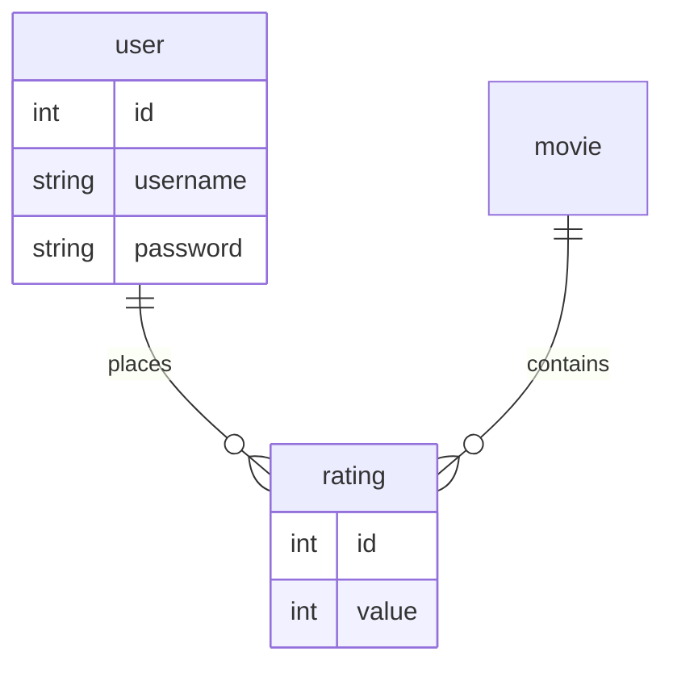

# Accés a dades mitjançant PHP PDO

PHP permet treballar en base de dades MySQL gràcies a dues llibreries. MySQLi i PDO. Com que MySQLi està
dissenyada exclusivament per a MySQL nosaltres aprofundirem en PDO, que permet connectar fins amb
12 sistemes gestors de base de dades diferents.

Les sigles PDO (_PHP Data Objects_) fan referència a una interfície de PHP
que ens permet accedir a bases de dades de qualsevol tipus en PHP.

Cada controlador de bases de dades que implemente la interfície PDO pot
exposar característiques específiques de la base de dades, com les
funcions habituals de l'extensió. Cal observar que no es pot realitzar
cap de les funcions de la bases de dades utilitzant l'extensió PDO per
si mateixa; s'ha d'utilitzar-ne una de PDO específica de la base de
dades per tenir accés a un servidor de base de dades.


PDO proporciona una capa d'abstracció d'accés a dades, el que significa
que, independentment de la base de dades que s'estiga utilitzant, s'usen
les mateixes funcions per fer consultes i obtenir dades.

Per saber els controladors PDO disponibles en el nostre sistema:

```php
print_r(PDO::getAvailableDrivers());
```

La informació oficial sobre PDO es troba en 
[http://php.net/manual/es/book.pdo.php](http://php.net/manual/es/book.pdo.php)

## Classes PDO, PDOStatement i PDOException

PDO proporciona 3 classes per a gestionar l'accés a la base de dades

- [`PDO`](http://php.net/manual/es/class.pdo.php): S'utilitza per representar la connexió entre PHP i un
  servidor de bases de dades.  
- [`PDOStatement`](http://php.net/manual/es/class.pdostatement.php): representa una sentència preparada i també ens
  permet accedir al conjunt de resultats associat.  
- [`PDOException`](http://php.net/manual/es/class.pdoexception.php): representa els errors generats PDO.
  
## Connexió a la base de dades

Per a crear una nova connexió s'utilitza la classe `PDO`:

```php
public __construct(string $dsn [, string $username [, string $passwd [, array $options ]]] )
```

El constructor té els següents paràmetres:

- `dsn`: cadena de connexió
- `username`: nom d'usuari
- `passwd`: contrasenya d'usuari
- `options`: permet afegir altres opcions de la connexió

```php
$pdo = new PDO("mysql:host=localhost; dbname=test", "dbuser", "1234");
```

En l'exemple anterior **mysql** representa una connexió a una base de dades MySQL (
podria ser: MSSQL, Sybase, sqlite, etc.) anomenada `test` que es troba al servidor `localhost`.
La connexió es realitzarà mitjançant l'usuari `dbuser` i la contrasenya `1234`.

```php
// Exemple de connexió a diferents tipus de bases de dades.
# Connectem a la base de dades
$host = 'www.local';
$hbname = 'cxbasex';
$user = 'cxbasex';
$pass = 'xxxxxx';

try {
    # MS SQL Server y Sybase amb PDO_DBLIB
    $pdo = new PDO("MSSQL:host=$host;dbname=$dbname, $user, $pass");
    $pdo = new PDO("Sybase:host=$host;dbname=$dbname, $user, $pass");

    /* MySQL amb PDO_MYSQL
     Perquè la connexió a mysql utilitzi les collation UTF-8 afegir charset = utf8 a string
     de la connexió. */
    $pdo = new PDO  ("mysql:host=$host;dbname=$dbname;charset=utf8", $user, $pass);

    // Perquè generi excepcions a l'hora de reportar errors.
    $pdo->setAttribute (PDO::ATTR_ERRMODE, PDO::ERRMODE_EXCEPTION);

    # SQLite Database
    $pdo = new PDO ("sqlite:my/database/path/database.db");
}
catch (PDOException $e) {
    die($e-> getMessage ());
}

// Si tot va bé en $pdo tindrem el objecte que gestionarà la connexió amb la base de dades.
```

### Tancar la connexió a la base de dades

Es recomana tancar sempre la connexió a la base de dades quan no es vaja
a utilitzar més durant el nostre procés.

Cal recordar que els recursos són limitats i quan hi ha pocs usuaris no
hi ha cap problema, però si tenim molts usuaris simultanis llavors és
quan sorgeixen problemes en haver assolit el nombre màxim de connexions
amb el servidor, per exemple.

En tancar la connexió de forma explícita accelerem l'alliberament de
recursos perquè estiguin disponibles per a altres usuaris.

```php
// Si vullguerem tancar la connexió amb la base de dades simplement podríem fer al final del fitxer.
$pdo = null;
```

## Execució de consultes

Per a realitzar consultes `PDO` proporciona tres mètodes:

- `PDO::query()` per a consultes de recuperació de dades (SELECT).
- `PDO::exec()` per a consultes d'inserció, modificació i esborrat de dades (INSERT, UPDATE i DELETE)
- `PDO::prepare()` per a consultes de tot tipus amb paràmetres. Aquest és el mètode recomanat si la consulta té paràmetres o si s'ha d'executar divereses vegades però això hem dedicat un apartat específic.

Una vegada executada la consulta les dades s'obtenen a través del mètode `PDOStatement::fetch()` o
`PDOStatement::fetchAll()`.

- `fetch()`: Obté la següent fila d'un recordset (conjunt de
  resultats). [http://php.net/manual/es/pdostatement.fetch.php](http://php.net/manual/es/pdostatement.fetch.php)
- `fetchAll()`: Retorna un array que conté totes les files del conjunt
  de resultats (el tipus de dades a retornar es pot indicar com a
  paràmetre). [http://php.net/manual/es/pdostatement.fetchall.php](http://php.net/manual/es/pdostatement.fetchall.php)

### Estil de búsqueda (_fetch style_)

Abans de cridar al mètode `fetch()` una bona idea és indicar-li com
volem que ens torne les dades de la base de dades.

Tindrem les següents opcions en el mètode `fetch()`:

- `PDO::FETCH_ASSOC`: Torna les dades en un array associatiu pel nom de camp de la
  taula.
- `PDO::FETCH_NUM`: Retorna un array indexat per la posició del camp.
- `PDO::FETCH_BOTH`: Retorna un array associatiu pel nom de camp de la taula i un
- indexat per la posició del camp. És una combinació dels dos estils anteriors. És l'estil per defecte.
- `PDO::FETCH_BOUND`: Assigna els valors retornats a les variables
  assignades amb el mètode `bindColumn()`.
- `PDO::FETCH_CLASS`: Assigna els valors dels camps a les propietats
  d'una classe. Si les propietats no existeixen en aquesta classe, les
  crearà.
- `PDO::FETCH_INTO`: Actualitza una instància existent d'una classe.
- `PDO::FETCH_LAZY`: Combina `PDO::FETCH_BOTH`/`PDO::FETCH_OBJ`,
  creant les variables de l'objecte a mesura que es van fent servir.
- `PDO::FETCH_OBJ`: Retorna un objecte anònim amb els noms de les
  propietats que es corresponen amb els noms de columnes.

Podem ajustar l'estil de búsqueda de dues formes:

Abans de recuperar registres

```php
$stmt->setFetchMode(PDO::FETCH_ASSOC);
```

O en el moment de recuperar-los:

```php
$stmt->fetch(PDO::FETCH_ASSOC);
$stmt->fechtall(PDO::FETCH_ASSOC);
```

!!! important "`PDO::FETCH_CLASS`"

    Cal saber que no podem usar `PDO::FETCH_CLASS` com a paràmetre de `PDOStatement::fetch()`. Cal controlar l'estil de
    búsqueda amb `PDOStatement::setFetchMode()`.

**FETCH_ASSOC**

Per executar la consulta SELECT si no tenim paràmetres en la consulta podrem usar `PDO::query()`

Vegem un exemple de consulta SELECT:

```php
try {
    #Per executar la consulta SELECT si no tenim paràmetres en la consulta podrem usar -> query ()
    $stmt = $pdo->query ('SELECT name, addr, city from colleague');

    /* Indiquem en quin format volem obtenir les dades de la taula en format d'array associatiu.
       Si no indiquem res per defecte s'usarà FETCH_BOTH el que ens permetrà accedir com a vector
        associatiu o array numèric. */
    $stmt->setFetchMode(PDO::FETCH_ASSOC);

    #Llegim les dades del recordset amb el mètode->fetch ()

    while ($row=$stmt->fetch()) {
       echo $row['name']. "<br/>";
       echo $row['addr']. "<br/>";
       echo $row['city']. "<br/>";
    }

     #Per alliberar els recursos utilitzats en la consulta SELECT
     $stmt = null;
 } catch (PDOException $err) {
        // Mostrem un missatge genèric d'error.
    echo "Error: executant consulta SQL.";
 }
```

**FETCH_OBJ**

En aquest estil de búsqueda es crearà un objecte estàndard (`stdClass`) per
cada fila que llegim del recordset.

Per exemple:

```php
try {
    #Creem la consulta
    $stmt = $pdo->query('SELECT name, addr, city from colleague');
    #Ajustem la manera d'obtenció de dades
    $stmt->setFetchMode(PDO::FETCH_OBJ);

    #Mostrem els resultats.
    #Fixeu-vos que es torna un objecte cada vegada que es llegeix una fila del recordset.

    while ($row = $stmt->fetch()) {
        echo $row->name. "<br/>";
        echo $row->addr. "<br/>";
        echo $row->city. "<br/>";
    }

        #Alliberem els recursos utilitzats per $stmt
    $stmt = null;
}
catch (PDOException $err)
{
    // Mostrem un missatge genèric d'error.
    echo "Error: executant consulta SQL.";
}
```

**FETCH_CLASS**

En aquest estil de búsqueda els registres es tornaran en una nova instància
de la classe indicada en el segon paràmetre, fent correspondre les columnes del conjunt de resultats amb els noms de les
propietats de la classe, i cridant al constructor després, a menys que también es proporcione
l'opció `PDO::FETCH_PROPS_LATE`. Si algun nom de camp no existeix com a propietat en la classe es crearà dinàmicament.

```php
class Persona
{
    private $name;

    public function __construct()
    {
        $this->decir();
    }

    public function decir()
    {
        if (isset($this->name)) {
            echo "Soy {$this->name}.\n";
        } else {
            echo "Aún no tengo nombre.\n";
        }
    }
}

$sth = $dbh->query("SELECT * FROM people");
$sth->setFetchMode(PDO::FETCH_CLASS, 'Persona');
$persona = $sth->fetch();
$persona->decir();
$sth->setFetchMode(PDO::FETCH_CLASS|PDO::FETCH_PROPS_LATE, 'Persona');
$persona = $sth->fetch();
$persona->decir();
```

Mostrarà:

```
Soy Alice.
Soy Alice.
Aún no tengo nombre.
Soy Bob.
```

## Consultes preparades

Com hem vist en l'apartat anterior les consultes poden acceptar
paràmetres. **La millor forma de realitzar aquestes consultes és
mitjançant les consultes preparades**.

Les consultes preparades ens aporten dues avantatges importants:

- Per a sentències que seran executades en múltiples ocasions amb
  diferents paràmetres optimitza el rendiment de la aplicació.
- Ajuda a prevenir injeccions SQL eliminant la necessitat de posar
  entre cometes manualment els paràmetres.

Per a construir una sentència preparada cal incloure uns marcadors en la
sentència SQL.

Hi ha tres formes de fer-ho:

```php
# Marcadors anònims
$stmt = $pdo->prepare("INSERT INTO colleague (name, addr, city) values (?, ?, ?)");

# Marcadors coneguts
$stmt = $pdo->prepare("INSERT INTO colleague (name, addr, city) values (:name, :addr, :city)");

# Sense marcadors. Aquest mètode està desaconsellat! Prohibit en el nostre cas.
$stmt = $pdo->prepare("INSERT INTO colleague (name, addr, city) values ($name, $addr, $city)");
```

Hauràs d'usar el primer o el segon mètode dels que es mostren
anteriorment. El tipus de marcadors que utilitzem afectaran a la forma
d'assignar els valors d'eixos marcadors.

### Assignació amb marcadors anònims

Per enllaçar els marcadors anònims amb el seu corresponent valor es pot
utilitzar `bindParam` o `bindValue`:

!!! warning "Marcadors anònims"
    
    ATENCIÓ:` $pdo->prepare()` usant marcadors anònims `?`, tracta totes les
    variables com si foren _string_, per la qual cosa farà servir cometes
    per delimitar els seus valors per defecte.


```php
# Marcadors anònims
$stmt = $pdo->prepare("INSERT INTO colleague (name, addr, city) values (?, ?, ?)");

# Assignem variables a cada marcador, indexats l'1 al 3
$stmt->bindParam(1, $name);
$stmt->bindParam(2, $addr);
$stmt->bindParam(3, $city);

# Inserim una fila.
$name = "Daniel";
$addr = "1 Wicked Way";
$city = "Arlington Heights";
$stmt->execute();

# Inserim un altra fila con valores diferents.
$name = "Steve"
$addr = "5 Circle Drive";
$city = "Schaumburg";
$stmt->execute();
```

Un altra forma d'assignació amb marcadors anònims és mitjançant un array
associatiu:

```php
 # Les dades que volem inserir
 $dades = ['Cathy', '9 Dark and Twisty Road', 'Cardiff'];

 $stmt = $pdo->prepare("INSERT INTO colleague (name, addr, city) values (?, ?, ?)");
 $stmt->execute($dades);
```

### Diferència entre l'ús de bindParam i bindValue

Amb `bindParam` es vincula la variable al paràmetre i en el moment de
fer l'_execute_ és quan s'assigna realment el valor de la variable a
aquest paràmetre.

Amb `bindValue` s'assigna el valor de la variable a aquest paràmetre
just en el moment d'executar la instrucció `bindValue`.

Exemple de diferència entre `bindParam` i `bindValue`:

```php
// Ejemplo con bindParam:
$sex = 'hombre';
$s = $dbh->prepare('SELECT name FROM estudiantes WHERE sexo = :sexo');
$s->bindParam(':sexo', $sex);
$sex = 'mujer';
$s->execute(); // se ejecutó con el valor WHERE sexo = 'mujer'

// El mismo ejemplo con bindValue:
$sex = 'hombre';
$s = $dbh->prepare('SELECT name FROM students WHERE sexo = :sexo');
$s->bindValue(':sexo', $sex);
$sex = 'mujer';
$s->execute(); // se ejecutó con el valor WHERE sexo = 'hombre'
```

### Assignació amb marcadors coneguts

Els marcadors coneguts són la forma més recomanable de treballar amb PDO, ja que a l'hora
de fer el `bindParam` o el `bindValue` es pot especificar
el tipus de dada i la seua longitud.

Format de `bindParam` amb marcadors coneguts:

```php
bindParam(':marcador', $variableVincular, TIPO DATOS PDO)
```

Exemple d'ús de `bindParam`:

```php
$stmt->bindParam(':calorias', $misCalorias, PDO::PARAM_INT);
$stmt->bindParam(':apellidos', $misApellidos, PDO::PARAM_STR, 35); // 35 caracteres como máximo.
```

Amb marcadors coneguts quedaria de la següent forma:

```php
$stmt = $pdo->prepare("INSERT INTO colleague (name, addr, city) value (:name, :addr, :city)");

# El primer argument de bindParam és el nom del marcador i el segon la variable
# que contindrà les dades.

 # Els marcadors conocidos siempre comienzan con :
$stmt->bindParam(':name', $name);
$name='Pepito';

$stmt->bindParam(':addr', $addr);
$addr='Duanes, 17';

$stmt->bindParam(':city', $city);
$city = 'Pego';

$stmt->execute();

# També podem fer-ho mitjançant un array associatiu
$dades = ['name' => 'Pepito', 'addr' => 'Duanes, 17', 'city' => 'Pego' );

# Fixeu-vos es passa l'array de dades en execute().
$stmt = $pdo->prepare("INSERT INTO colleague (name, addr, city) value (:name, :addr, :city)");
$stmt->execute($dades);

# La última instrucción se podría poner también así:
$stmt->execute([
    'name' => 'Pepito',
    'addr' => 'Duanes, 17',
    'city' => 'Pego'
]);
```

Una altra característica dels marcadors coneguts és que ens permetran
treballar amb objectes directament a la base de dades, assumint que les
propietats d'aquest objecte coincideixen amb els noms dels camps de la
taula a la base de dades.

Exemple d'ús de marcadors coneguts i objectes:

```php

# Un objeto sencillo
class Person {
    public $name;
    public $addr;
    public $city;

    function __construct($n,$a,$c) {
        $this->name = $n;
        $this->addr = $a;
        $this->city = $c;
    }
    # etc ...
}

$cathy = new Person('Pepito','Duanes, 17','Pego');

# Preparación de la consulta
$stmt = $pdo->prepare("INSERT INTO colegas (name, addr, city) value (:name, :addr, :city)");

# Inserción del objeto
$stmt->execute((array)$cathy);
```

### Exemple d'ús

Per a utilitzar les consultes preparades seguirem sempre aquest esquema:


```php
$pdo = new PDO('sqlite:/path/db/users.db');

# 1. Preparem la connexió
$stmt = $pdo->prepare('SELECT name FROM users WHERE id = :id');

$id = 5;

# 2. Vinculem els paràmetres
$stmt->bindParam(':id', $id, PDO::PARAM_INT);

# 3. Executem la consulta
 $stmt->execute();

 # 4. Obtenim els registres

 # Un a un
 $row = $stmt->fetch();

 # Tots a l'hora
 $rows = $stmt->fetchAll();

```

!!! note "Dates en MySQL"

    Recorda que el tipus DATE de MySQL es recupera com un _string_ en format "YYYY-MM-DD" i a l'hora
d'emmagatzemar-lo cal que tinga el mateix format.

    Si fóra DATETIME també caldria afegir l'hora "YY-MM-DD hh:mm:ss".


  
## Inserció, modificació i eliminació de dades de la BBDD

Inserir noves dades, actualitzar-les o esborrar-les són algunes de les
operacions més comunes en una base de dades. Amb PDO podem fer aquestes aquestes
operacions en 3 passos.


Exemple d'ús:

```php
# $stmt serà un objecte de tipus PDOStatement (consulta preparada)
$stmt = $pdo->prepare("INSERT INTO colleague(name, addr, city) values (:name, :addr, :city)");

# Assignem els valors dels marcadors
$name = "Josep"
$addr = "Duanes, 17"
$city = "Pego"

$stmt->BindValue("name", $name);
$stmt->BindValue("addr", $addr);
$stmt->BindValue("city", $city);

# Executem la consulta amb ->execute() mètode de l'objecte PDOStatement
# Este mètode devuelve true o false.
$result = $stmt->execute();

```

### Exemples CRUD (**C**reate, **R**ead, **U**pdate, **D**elete): INSERT, UPDATE y DELETE

**INSERT**

```php
try {
    $pdo = new PDO("mysql:host=$host;dbname=$dbname;charset=utf8", $username, $password);
    $pdo->setAttribute(PDO::ATTR_ERRMODE, PDO::ERRMODE_EXCEPTION);

    $stmt = $pdo->prepare('INSERT INTO colleague (name, addr, city ) VALUES(:name,
    :addr, :city)');

    $stmt->execute([
    ':name' => 'Josep',
    ':addr' => 'Duanes, 17',
    ':city' => 'Pego'
    ]);

    # Affected Rows?
    echo $stmt->rowCount(); // 1
} catch(PDOException $e) {
    echo 'Error: ' . $e->getMessage();
}
```

**UPDATE**

```php
$id = 5;
$name = "Joe the Plumber";

try {
    $pdo = new PDO("mysql:host=$host;dbname=$dbname;charset=utf8", $username, $password);
    $pdo->setAttribute(PDO::ATTR_ERRMODE, PDO::ERRMODE_EXCEPTION);

    $stmt = $pdo->prepare('UPDATE someTable SET name = :name WHERE id = :id');
    $stmt->execute(array(
    ':id' => $id,
    ':name' => $name
    ));

    echo $stmt->rowCount(); // 1
} catch(PDOException $e) {
    echo 'Error: ' . $e->getMessage();
}
```

**DELETE**

```php
$id = 5; // From a form or something similar

try {
    $pdo = new PDO("mysql:host=$host;dbname=$dbname;charset=utf8", $username, $password);
    $pdo->setAttribute(PDO::ATTR_ERRMODE, PDO::ERRMODE_EXCEPTION);

    $stmt = $pdo->prepare('DELETE FROM someTable WHERE id = :id');
    $stmt->bindParam(':id', $id); // this time, we'll use the bindParam method
    $stmt->execute();

    echo $stmt->rowCount(); // 1
} catch(PDOException $e) {
    echo 'Error: ' . $e->getMessage();
}
```

## Alguns mètodes d'interès

Alguns mètodes interessant i que podem utilitzar per a millorar la gestió de l'accés a dades són:

- `PDO::lastInsertId()`, ens torna la clau primària (`id`) del últim registre inserit en la base de dades.
- `PDOStatement::rowCount()`, ens torna el número de files afectades por una sentència DELETE, INSERT, o UPDATE.

## Gestió d'errors en l'accés

PDO pot utilitzar les excepcions per gestionar els errors, el que
significa que qualsevol cosa que fem amb PDO podríem encapsular en un
bloc try/catch per gestionar si produeix algun error.

Podem forçar PDO perquè treballi en qualsevol de les tres maneres
següents:

- `PDO::ERRMODE_SILENT`. És el mode per defecte. Aquí haurem de
  revisar els errors usant `errorCode()` i `errorInfo()`.
- `PDO::ERRMODE_WARNING`. Genera errors de revisió de resultats
  PHP però permetria l'execució normal de l'aplicació.
- `PDO::ERRMODE_EXCEPTION`. Serà la forma més utilitzada en PDO.
  Dispara una excepció permetent-nos gestionar l'error de forma
  amigable.

```php
//Activació de la manera de treball de PDO
$pdo-> setAttribute (PDO::ATTR_ERRMODE, PDO::ERRMODE_SILENT);
$pdo-> setAttribute (PDO::ATTR_ERRMODE, PDO::ERRMODE_WARNING);

// Es recomana activar aquesta opció per gestionar els errors amb PDOException
$pdo-> setAttribute (PDO::ATTR_ERRMODE, PDO::ERRMODE_EXCEPTION);
```

!!! warning "Excepcions"
    
    Es recomana activar aquesta opció per gestionar els errors amb `PDOException`, d'altra forma no 
apareixerà cap missatge i serà complicat detectar-los.

```php
$pdo-> setAttribute (PDO::ATTR_ERRMODE, PDO::ERRMODE_EXCEPTION);
```

**Exemple d'ús:**

```php

# Connectem a la base de dades
$host = 'www.local';
$dbname = 'cxbasex';
$user = 'cxbasex';
$pass = 'xxxxxx';

try {
    $pdo=new PDO ("mysql:host=$host;dbname=$dbname;charset=utf8", $user, $pass);
    $pdo->setAttribute (PDO::ATTR_ERRMODE, PDO::ERRMODE_EXCEPTION);
}
catch (PDOException $e) {
    echo "S'ha produït un error en intentar connectar al servidor MySQL:". $e->getMessage();
}

try {
    # Un altre Exemple d'error! DELECT en lloc de SELECT!
    $pdo->exec( 'DELECT name FROM people');
}
catch (PDOException $e) {
    echo "S'ha produït un error en l'execució de la consulta:". $e->getMessage();

    /* En aquest cas hem mostrat el missatge d'error i, a més emmagatzemem
       en un fitxer els errors generats. */
    file_put_contents ('PDOErrors.txt', $e->getMessage(), FILE_APPEND);
}
```

## Transaccions

Una transacció en un Sistema de Gestió de Bases de Dades és un conjunt
d'ordres que s'executen formant una unitat de treball, és a dir, en
forma indivisible o atòmica.

Un SGBD es diu transaccional si és capaç de mantenir la integritat de
dades, fent que aquestes transaccions no puguin finalitzar en un estat
intermedi. Quan per alguna causa el sistema ha de cancel·lar la
transacció, comença a desfer les ordres executades fins a deixar la base
de dades en el seu estat inicial (anomenat punt d'integritat), com si
l'ordre de la transacció mai s'hagués realitzat. Una transacció ha de
comptar amb ACID (un acrònim anglès) que vol dir: Atomicidad,
consistència, aïllament i durabilitat.

### Transaccions en PDO

Com ja hem comentat, no tots els SGBD són transaccionals. Però també es
possible que tot i que el SGBD ho siga el motor d'emmagatzemat no ho
suporte. Per la qual cosa si necessites utilitzar transaccions hauràs
d'assegurar-se que estiguen suportades pel motor d'emmagatzematge que
gestiona les teves taules en MySQL. Per exemple el motor MyISAM no les
suporta.

Per defecte PDO treballa en mode autocommit. Confirma automàticament
cada sentència que executa el servidor.

Per treballar amb transaccions, PDO incorpora tres mètodes:

  - `beginTransaction`. Deshabilita la manera autocommit i comença una
    nova transacció, que finalitzarà quan executis un dels dos mètodes  
    següents.
  - ` commit`. Confirma la transacció actual.
  - `rollback`. Reverteix els canvis duts a terme a la transacció
    actual.

Un cop executat un `commit` o `rollback`, es tornarà al mode de
confirmació automàtica.

Si utilitzem un motor que no suporta transaccions PDO no mostrarà cap
error, simplement serà incapaç de realitzar un `rollback` si fora
necessari.

### Esquema bàsic d'ús de transaccions amb PDO

```php

    #Esquema bàsic d'ús de PDO
    try{ 
        $pdo->beginTransaction(); 
        $pdo->exec('DELETE ...'); 
        $pdo->exec('UPDATE ...'); 
        $pdo->commit(); 
    }
    catch(PDOException $exception) { 
        $pdo->rollback(); 
    }
```

### Exemple

```php
    $mbd = new PDO('odbc:SAMPLE', 'db2inst1', 'ibmdb2',
            array(PDO::ATTR_PERSISTENT => true));
        echo "Conectado\n";
    } catch (Exception $e) {
        die("No se pudo conectar: " . $e->getMessage());
    }
    
    try {
        $mbd->setAttribute(PDO::ATTR_ERRMODE, PDO::ERRMODE_EXCEPTION);
    
        $mbd->beginTransaction();
        $mbd->exec("insert into staff (id, first, last) values (23, 'Joe', 'Bloggs')");
        $mbd->exec("insert into salarychange (id, amount, changedate) 
          values (23, 50000, NOW())");
        $mbd->commit();
    
    } catch (Exception $e) {
        $mbd->rollBack();
        echo "Fallo: " . $e->getMessage();
    }
```

## Projecte MovieFX


L'objectiu és afegir al projecte funcionalitats de base de dades.

### Crear la base de dades

1. Crea la base de dades `movieFX`.
2. Crea la següent taula:

```sql
CREATE TABLE `movie` (
  `id` int(11) NOT NULL,
  `title` varchar(50) COLLATE utf8_spanish2_ci NOT NULL,
  `overview` text COLLATE utf8_spanish2_ci NOT NULL,
  `release_date` date NOT NULL,
  `rating` float NOT NULL,
  `poster` varchar(50) COLLATE utf8_spanish2_ci DEFAULT NULL
) ENGINE=InnoDB DEFAULT CHARSET=utf8 COLLATE=utf8_spanish2_ci;

ALTER TABLE `movie`
  ADD PRIMARY KEY (`id`);

ALTER TABLE `movie`
  MODIFY `id` int(11) NOT NULL AUTO_INCREMENT;
COMMIT;
```

3. Crea l'usuari `dbuser` amb `1234` de contrasenya.
4. Dona-li els privilegis necessaris perquè sols puga fer SELECT, INSERT, DELETE i UPDATE

!!! danger "Copiar i pegar"

    La temptació de copiar i pegar codi serà gran, però en aquest punt podeu fer-ho sense pietat. Més avant vorem tècniques per a evitar-ho.

### Modificar la pàgina principal

1. Modifica `index.php` perquè obtinga les pel·lícules de la base de dades (com un _array_ associatiu).
2. Caldrà transformar els resultats en un _array_ d'objectes `movie`.

### Modificar la pàgina de detall

1. Modifica `movie.php` perquè obtinga la pel·licula seleccionada de la base de dades (com un _array_ associatiu).
2. Caldrà transformar els resultats en un _array_ d'objectes `movie`.

### Inserint noves pel·lícules

1. Crea un formulari en (`movies-create.php`) per a inserir noves pel·lícules. 
2. Posa un enllaç al formulari en la pàgina principal.
3. La pàgina (`movies-create.php`) processarà el formulari i després de validar tots
  els camps els inserirà a la base de dades.

Cal tenir en compte la separació de la lògica i la presentació.

### Modificant i esborrants pel·lícules

1. Crea el formulari per a editar pel·lícules (`movies-edit.php`).
2. Crea el formulari per a esborrar pel·lícules (`movies-delete.php`).
3. Afig en cada pel·lícula un enllaç per a esborrar i editar la película.

### Creant transaccions

Per poder fer aquesta activitat caldrà tenir en la base de dades les taules: `user` i `rating`.



```sql
CREATE TABLE `rating` (
  `id` int(11) NOT NULL,
  `value` int(11) NOT NULL,
  `movie_id` int(11) NOT NULL,
  `user_id` int(11) NOT NULL
) ENGINE=InnoDB DEFAULT CHARSET=utf8 COLLATE=utf8_spanish2_ci;


CREATE TABLE `user` (
  `id` int(11) NOT NULL,
  `username` varchar(50) COLLATE utf8_spanish2_ci NOT NULL,
  `password` varchar(255) COLLATE utf8_spanish2_ci NOT NULL
) ENGINE=InnoDB DEFAULT CHARSET=utf8 COLLATE=utf8_spanish2_ci;

ALTER TABLE `user`
  ADD PRIMARY KEY (`id`);

ALTER TABLE `user`
  MODIFY `id` int(11) NOT NULL AUTO_INCREMENT;

ALTER TABLE `rating`
  ADD PRIMARY KEY (`id`),
  ADD UNIQUE KEY `movie_user_idx` (`movie_id`,`user_id`) USING BTREE;

ALTER TABLE `rating`
  MODIFY `id` int(11) NOT NULL AUTO_INCREMENT;

ALTER TABLE `rating`
  ADD CONSTRAINT `rating_movie_fk` FOREIGN KEY (`movie_id`) REFERENCES `movie` (`id`),
  ADD CONSTRAINT `rating_user_fk` FOREIGN KEY (`user_id`) REFERENCES `user` (`id`);
COMMIT;
```

1. Els usuaris podran valorar una pel·lícula amb un número de l'1 al 5, per aquest motiu afegirem en la classe `User` el mètode `rate` que rebrà com a paràmetres una pel·lícula i una valoració.
2. El mètode `rate` crearà un nou registre en la taula `rating` per evitar duplicats i a mès, actualitzarà la valoració de la pel·lícula tenint en compte la valoració de l'usuari.
3. Aquestes dos sentències contra la base de dades estaran dintre d'una transacció, ja que s'han d'executar com si foren una.