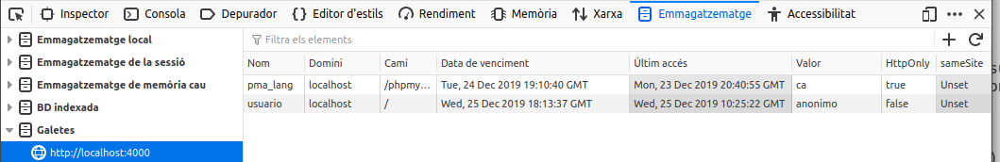

# Autenticació d'usuaris i control d'accés

Moltes vegades és important verificar la identitat dels dos extrems d'una comunicació, hi ha mètodes per identificar tant al servidor en el qual s'allotja el lloc web, com a l'usuari del navegador que es troba en l'altre extrem.

Els llocs web que necessiten emprar identificació de servidor, com les botigues o els bancs, utilitzen el **protocol HTTPS**. Aquest protocol requereix d'un certificat digital vàlid, signat per una autoritat fiable, que és verificat pel navegador quan s'accedeix a la pàgina web. A més, HTTPS utilitza mètodes de xifrat per crear un canal segur entre el navegador i el servidor, de tal manera que no es puga interceptar la informació que es transmet pel mateix.

Per identificar els usuaris que visiten un lloc web, es poden utilitzar diferents mètodes com el DNI digital o certificats digitals d'usuari (document digital que conté informació sobre l'usuari com el nom o l'adreça. Aquesta informació està signada per una altra entitat, anomenada entitat certificadora, que ha de ser de confiança i garanteix que la informació que conté és certa), però el més estès és sol·licitar a l'usuari certa informació que només ell coneix: la combinació d'un nom d'usuari i una contrasenya.

En les unitats anteriors vas aprendre a utilitzar aplicacions web per gestionar informació emmagatzemada en bases de dades. En la majoria dels casos és important implantar en aquest tipus de aplicacions web, les que accedeixen a bases de dades, algun mecanisme de control d'accés que obligui a l'usuari a identificar-se. Un cop identificat, es pot limitar l'ús que pot fer de la informació.

Així, pot haver llocs web en els quals els usuaris autenticats poden utilitzar només una part de la informació (com els bancs, que permeten als seus clients accedir únicament a la informació relativa als seus comptes). Altres llocs web necessiten separar en grups als usuaris autentificats, de tal manera que la informació a la qual accedeix un usuari depèn del grup en què aquest es trobe. Per exemple, una aplicació de gestió d'una empresa pot tenir un grup d'usuaris als qui permet visualitzar la informació, i un altre grup d'usuaris que, a més de visualitzar la informació, també la poden modificar.

!!! note "Autenticació, control d'accés i seguretat en les comunicacions"

    Has distingir l'autenticació dels usuaris i el control d'accés, de la utilització de mecanismes per assegurar les comunicacions entre l'usuari de el navegador i el servidor web. Encara que tots dos aspectes solen anar units, són independents.


En els exemples d'aquesta unitat, la informació d'autenticació (nom i contrasenya dels usuaris) s'envia en text pla des del navegador fins al servidor web. Aquesta pràctica és altament insegura i mai s'ha d'usar sense un protocol com HTTPS que permeta xifrar les comunicacions amb el lloc web. No obstant això, la configuració de servidors web que permeten fer servir el protocol HTTPS per xifrar la informació que reben i transmeten no forma part dels continguts d'aquest mòdul. Per aquest motiu, durant aquesta unitat utilitzarem únicament el protocol no segur HTTP.

## Mecanismes d'autenticació via HTTP

El protocol HTTP ofereix un mètode senzill per autenticar els usuaris. El procés és el següent:

- El servidor web ha de proveir algun mètode per definir els usuaris que s'utilitzaran i com es poden autentificar. A més, s'hauran de definir els recursos als quals es restringeix l'accés i quina llista de control d'accés (ACL - llista de permisos sobre un objecte (fitxer, directori, etc.), que indica quins usuaris poden utilitzar l'objecte i les accions concretes que poden realitzar amb el mateix (lectura, escriptura, esborrat, etc.)) s'aplica a cada un.
- Quan un usuari no autenticat intenta accedir a un recurs restringit, el servidor web respon amb un error de "Accés no autoritzat" (codi 401).
- El navegador rep l'error i obre una finestra per sol·licitar a l'usuari que es autentifiqui mitjançant el seu nom i contrasenya.
- La informació d'autenticació de l'usuari s'envia a servidor, que la verifica i decideix si permet o no l'accés a el recurs sol·licitat. Aquesta informació es manté en el navegador per utilitzar-se en posteriors peticions a aquest servidor.

Al servidor web Apache, el que has estat utilitzant en anteriors unitats, hi ha una utilitat en línia d'ordres, `htpasswd`, que permet emmagatzemar en un fitxer una llista d'usuaris i els seus respectives contrasenyes. La informació relativa a les contrasenyes s'emmagatzema xifrada; tot i així, és convenient crear aquest fitxer en un lloc no accessible pels usuaris de servidor web.

http://httpd.apache.org/docs/2.0/es/howto/auth.html

Per exemple, per crear el fitxer d'usuari i afegir-li el usuari "dwes", pots fer:

```shell
sudo htpasswd -c users dwes
```

i introduir la contrasenya corresponent a aquest usuari.

L'opció `-c` indica que s'ha de crear el fitxer, per la qual cosa només hauràs de fer-la servir quan introdueixis el primer usuari i contrasenya. Fixa't que en l'exemple anterior, el
fitxer es crea a la ruta /etc/apache2/users, que en principi no és accessible via web.

Per indicar-li a l'servidor Apache quins recursos tenen accés restringit, una opció és crear un fitxer `.htaccess` en el directori en què es trobin, amb les següents directives:

```shell
AuthName "Contingut restringit"
AuthType Basic
AuthUserFile /etc/apache2/users
requereix valid-user
```

El significat de cadascuna de les directives anteriors és el següent:

| Directiva    | significat                                                                                                                                                                                                       |
| ------------ | ---------------------------------------------------------------------------------------------------------------------------------------------------------------------------------------------------------------- |
| AuthName     | Nom de domini que es farà servir en l'autenticació. Si el client s'autentica correctament, aquesta mateixa informació d'autenticació s'utilitzarà automàticament en la resta de les pàgines de el mateix domini. |
| AuthType     | Mètode d'autenticació que es farà servir. A més de l'mètode Basic, Apache també permet utilitzar el mètode Digest.                                                                                               |
| AuthUserFile | Camí de l'arxiu de credencials que has creat amb htpasswd.                                                                                                                                                       |
| Require      | Permet indicar que només puguin accedir alguns usuaris o grups d'usuaris concrets. Si indiquem "valid-user", podran accedir tots els usuaris que es s'autentifiquin correctament.                                |

A més, hauràs de assegurar-te que en la configuració d'Apache s'utilitza la directiva `AllowOverride` perquè s'aplique correctament la configuració que figura en els fitxers `.htaccess`. Més detalls en [http://httpd.apache.org/docs/2.0/es/mod/core.html#allowoverride](http://httpd.apache.org/docs/2.0/es/mod/core.html#allowoverride)

A l'incloure l'opció `-c` el que fem és crear un nou fitxer, amb la qual cosa eliminem el contingut anterior del mateix.

## Mecanismes d'autenticació

Des PHP pots accedir a la informació d'autenticació HTTP que ha introduït l'usuari utilitzant l'array superglobal `$_SERVER`.

| valor                       | contingut                                                  |
| --------------------------- | ---------------------------------------------------------- |
| `$_SERVER['PHP_AUTH_USER']` | Nom d'usuari que s'ha introduït.                           |
| `$_SERVER['PHP_AUTH_PW']`   | Clau introduïda.                                           |
| `$_SERVER['AUTH_TYPE']`     | Mètode HTTP usat per autentificar. Pot ser Basic o Digest. |

És a dir, que si crees una pàgina web que mostre els valors d'aquestes variables, i prepares el servidor web per utilitzar autenticació HTTP, quan accedisques a aquesta pàgina amb l'usuari "dwes" obtindràs alguna cosa com el següent:

```html
<!DOCTYPE html PUBLIC "- // W3C // DTD HTML 4.01 Transitional // EN" "http://www.w3.org/TR/html4/loose.dtd ">
<!-- Desenvolupament Web a Entorn Servidor -->
<!-- Tema 4: Desenvolupament d'aplicacions web amb PHP -->
<!-- Exemple: Autenticació HTTP -->
<html>
  <head>
    <meta http-equiv="content-type" content="text / html; charset = UTF-8" />
    <title>Exemple Tema 4: Autenticació HTTP</title>
    <link href="dwes.css" rel="stylesheet" type="text / css" />
  </head>
  <body>
    <?php
    echo "Nom d'usuari:". $_ SERVER['PHP_AUTH_USER']. "<br />"; echo
    "Contrasenya:". $_ SERVER['PHP_AUTH_PW']. "<br />"; echo "Mètode
    d'autenticació:". $_SERVER['AUTH_TYPE']. "<br />"; ?>
  </body>
</html>
```

Si no introdueixes un usuari/contrasenya vàlids, el navegador et mostrarà l'error 401.

A més, en PHP pots utilitzar la funció `header` per forçar que el servidor envie un error de "Accés no autoritzat" (codi 401). D'aquesta manera no cal utilitzar fitxers `.htaccess` per indicar-li a Apache quins recursos estan restringits. En el seu lloc, pots afegir les següents línies en les teves pàgines PHP:

```php
<?php
if (!isset($_ SERVER['PHP_AUTH_USER'])) {
    header ('WWW-Authenticate: Basic Realm = "Contingut restringit"');
    header ('HTTP/1.0 401 Unauthorized');
    echo "Usuari no reconegut!";
    exit;
}
?>
```

La funció `header` envia capçaleres HTTP (bloc de dades que forma part de l'protocol HTTP i s'envia abans de la informació pròpia que es transmet. Permet especificar codis d'estat, accions requerides a servidor, o el tipus d'informació que es transmet), però s'ha d'utilitzar abans que es mostre res per pantalla. En cas contrari, obtindràs un error. Més informació: [http://es.php.net/manual/es/function.header.php](http://es.php.net/manual/es/function.header.php)

Amb el codi anterior, la pàgina envia un error 401, el que força al navegador a sol·licitar les credencials d'accés (nom d'usuari i contrasenya). Si s'introdueixen, s'executa la resta de la pàgina i es mostra el seu contingut. En aquest cas, caldria afegir algun codi per comprovar que el nom d'usuari i contrasenya són vàlids, tal com veurem a continuació. Si es prem el botó "Cancel", es mostra el missatge d'error que s'indica. Modifica la pàgina anterior utilitzant la funció header perquè sol·liciti les credencials a l'usuari.

Hauràs de crear una pàgina similar a l'anterior, i afegir el codi per forçar l'error 401 abans de qualsevol altre.

```php
<!DOCTYPE html PUBLIC "- // W3C // DTD HTML 4.01 Transitional // EN" " http://www.w3.org/TR/html4/loose.dtd ">
<!-- Desenvolupament Web a Entorn Servidor -->
<!-- Tema 4: Desenvolupament d'aplicacions web amb PHP -->
<!-- Exemple: Funció header per autenticació HTTP -->
<?php
    if (!isset($_SERVER['PHP_AUTH_USER'])) {
        header('WWW-Authenticate: Basic Realm = "Contingut restringit"');
        header('HTTP / 1.0 401 Unauthorized');
        echo "Usuari no reconegut!";
        exit;
    }
?>
<html>
<head>
<meta http-equiv = "content-type" content = "text / html; charset = UTF-8">
<title> Exercici: Funció header per autenticació HTTP </ title>
<link href = "dwes.css" rel = "stylesheet" type = "text / css">
</head>
<body>
<?php
    echo "Nom d'usuari:". $_ SERVER['PHP_AUTH_USER']. "<br />";
    echo "Contrasenya:". $_ SERVER['PHP_AUTH_PW']. "<br />";
?>
</body>
</html>
```

## Incorporació de mètodes d'autenticació a una aplicació web

Si utilitzes la funció `header` per forçar el navegador a sol·licitar credencials HTTP, l'usuari introduirà un nom i una contrasenya. Però el servidor no ha de verificar aquesta informació; hauràs de ser tu qui proveïsca un mètode per comprovar que les credencials que ha introduït l'usuari són correctes.

El mètode més simple és incloure en el codi PHP de la teva pàgina les sentències necessàries per comparar les dades introduïdes amb altres dades fixos. Per exemple, per a permetre l'accés a un usuari "dwes" amb contrasenya "abc123.", pots fer:

```php
if ($_SERVER['PHP_AUTH_USER']!='dwes' || $_SERVER['PHP_AUTH_PW']!='abc123.') {
    header('WWW-Authenticate: Basic Realm = "Contingut restringit"');
    header('HTTP / 1.0 401 Unauthorized');
    echo "Usuari no reconegut!";
    exit;
}
?>
```

Recorda que el codi PHP no s'envia al navegador, de manera que la informació d'autenticació que introdueixis en el codi no serà visible per l'usuari. No obstant això, això farà el teu codi menys portable. Si necessites modificar el nom d'usuari o la contrasenya, hauràs de fer modificacions en el codi. A més, no podràs permetre a l'usuari introduir la seva pròpia contrasenya.

Una solució millor és utilitzar un emmagatzematge extern per als noms d'usuari i les seves
contrasenyes. Per això podries emprar un fitxer de text, o millor encara, una base de dades. La informació d'autenticació podrà estar aïllada en la seva pròpia base de dades, o compartir espai d'emmagatzematge amb les dades que utilitze la teva aplicació web.

Si vols emmagatzemar la informació dels usuaris a la base de dades "`dwes`", has de crear una nova taula en la seva estructura. Per a això, revisa i executa aquestes sentències SQL.

```sql
-- Seleccionem la base de dades
USE dwes;

-- Creem la taula
CREATE TABLE usuaris (
usuari VARCHAR (20) NOT NULL PRIMARY KEY,
contrasenya VARCHAR (32) NOT NULL
) ENGINE = InnoDB;

-- Creem l'usuari dwes
INSERT INTO usuaris (usuari, contrasenya) VALUES
('dwes', 'e8dc8ccd5e5f9e3a54f07350ce8a2d3d');

```

Tot i que es podrien emmagatzemar les contrasenyes en text pla, és millor fer-ho en format encriptat. En l'exemple anterior, per a l'usuari "dwes" s'emmagatzema el hash MD5 (mètode per generar un resum d'un text o un document, de tal manera que a partir de l'resum obtingut no és possible recuperar el text original ni estar un altre text a partir de el qual s'obtingui el mateix resum. Es diu hash a el resum obtingut a l'aplicar una funció hash. Una de les funcions hash més esteses és MD5, que genera 128 bits com a resum (normalment es representa mitjançant una cadena de text de 28 caràcters o mitjançant 32 dígits hexadecimals)) corresponent a la contrasenya "abc123.". En PHP pots utilitzar la funció md5 per calcular el hash MD5 d'una cadena de text.

http://es.php.net/manual/es/function.md5.php

```html+php

// Si l'usuari encara no s'ha entrat, demanem les credencials
if (!isset ($_SERVER [ 'PHP_AUTH_USER'])) {
    header ('WWW-Authenticate: Basic realm = "Contingut restringit"');
    header ("HTTP/1.0 401 Unauthorized");
    exit;
}
// Si ja ha enviat les credencials, les vam comprovar amb la base de dades
else {
    // Connectem a la base de dades
    @$dwes = new mysqli("localhost", "dwes", "abc123.", "Dwes");
    $error = $dwes-> connect_errno;
    // Si es va establir la connexió
    if ($error == null) {
        // Executem la consulta per comprovar si existeix
        // aquesta combinació d'usuari i contrasenya
        $sql ​​= "SELECT usuari FROM usuaris
            WHERE usuari = '$_ SERVER[PHP_AUTH_USER]' AND
            contrasenya = md5 ( '$_ SERVER[PHP_AUTH_PW]') ";
        $resultat = $dwes-> query ($sql);
        // Si no existeix, es tornen a demanar les credencials
        if ($resultat-> num_rows == 0) {
            header ( 'WWW-Authenticate: Basic realm = "Contingut restringit"');
            header ( "HTTP / 1.0 401 Unauthorized");
            exit;
        }
        $resultat->close();
        $dwes->close();
    }
}

<!DOCTYPE html PUBLIC "- // W3C // DTD HTML 4.01 Transitional // EN" "http://www.w3.org/TR/html4/loose.dtd " >
<!-- Desenvolupament Web a Entorn Servidor -->
<!-- Tema 4: Desenvolupament d'aplicacions web amb PHP -->
<!-- Exemple: Utilització de MySQL per autenticació HTTP -->
<html>
    <head>
        <meta http-equiv = "content-type" content = "text / html; charset = UTF-8">
        <title> Exemple Tema 4: Utilització de MySQL per autenticació HTTP </ title>
        <link href = "dwes.css" rel = "stylesheet" type = "text / css">
    </head>
    <body>
    <?php
        echo "Nom d'usuari:". $_ SERVER [ 'PHP_AUTH_USER']. "<br />";
        echo "Hash de la contrasenya:" .md5 ($_ SERVER [ 'PHP_AUTH_PW']). "<br />";
    ?>
    </body>
</html>
```

## Galetes (_cookies_)

Una galleta és un fitxer de text que un lloc web guarda a l'entorn de l'usuari de navegador. El seu ús més típic és l'emmagatzematge de les preferències de l'usuari (per exemple, l'idioma en que s'han de mostrar les pàgines), perquè no hagi de tornar a indicar-les la propera vegada que visiteu el lloc.

Si utilitzes Firefox com a navegador, pots accedir a `Desenvolupador web` &ndash; `Inspector d'emmagatzematge` des del menú principal. Entre les seves característiques et permet consultar i editar les galetes emmagatzemades en el mateix.



En PHP, per emmagatzemar una galleta al navegador de l'usuari, pots utilitzar la funció `setcookie`. L'únic paràmetre obligatori que has de fer servir és el nom de la galleta, però admet diversos paràmetres més opcionals.

!!! information "setcookie"
    Per a més informació consulta: [https://www.php.net/manual/es/function.setcookie.php](https://www.php.net/manual/es/function.setcookie.php).


Per exemple, si vols emmagatzemar en una galleta el nom d'usuari que es va transmetre a les credencials HTTP (és només un exemple, no és en absolut aconsellable emmagatzemar informació relativa a la seguretat en les galetes), pots fer:

```php
setcookie ("nom_usuari", $_SERVER['PHP_AUTH_USER'], time () + 3600);
```

Els dos primers paràmetres són el nom de la galleta i el seu valor. El tercer és la data de caducitat de la mateixa (una hora des del moment en què s'execute). En cas de no figurar aquest paràmetre, la galleta s'eliminarà quan es tanqui el navegador. Tingues en compte que també es poden aplicar restriccions a les pàgines de el lloc que poden accedir a una galleta en funció de la ruta.

Les galetes es transmeten entre el navegador i el servidor web de la mateixa manera que les credencials que acabes de veure; utilitzant les capçaleres de el protocol HTTP. **Per això, les
sentències `setcookie` s'han d'enviar abans que el navegador mostri cap informació a pantalla.**

El procés de recuperació de la informació que emmagatzema una galleta és molt simple. quan accedeixes a un lloc web, el navegador li envia de forma automàtica tot el contingut de les galetes que emmagatzemi relatives a aquest lloc en concret. Des PHP pots accedir a aquesta informació per mitjà de l'array `$_COOKIE`.

!!! important "important"

    Sempre que utilitzes galetes en una aplicació web, heu de tenir en compte que en última instància la seva disponibilitat està controlada pel client. Per exemple, alguns usuaris deshabiliten les galetes al navegador perquè pensen que la informació que emmagatzemen pot suposar un potencial problema de seguretat. O la informació que emmagatzemen pot arribar a perdre perquè el usuari decideix formatar l'equip o simplement eliminar-les de sistema.

Si un cop emmagatzemada una galleta al navegador vols eliminar abans que expire, pots utilitzar la mateixa funció `setcookie` però indicant una data de caducitat anterior a l'actual.

Sobre el mateix exercici anterior, emmagatzema en una galleta l'últim instant en què el usuari va visitar la pàgina. Si és la seva primera visita, mostra un missatge de benvinguda. En cas contrari, mostra la data i hora de la seva anterior visita.

Revisa la solució proposada. Hauràs utilitzar la funció `setcookie` per guardar l'instant de la seva anterior visita i mostrar el seu contingut utilitzant l'array `$_COOKIE`.

```php
// Si l'usuari encara no s'ha entrat, demanem les credencials
if (!isset ($_ SERVER['PHP_AUTH_USER'])) {
    header ('WWW-Authenticate: Basic realm = "Contingut restringit"');
    header ("HTTP / 1.0 401 Unauthorized");
    exit;
}
// Si ja ha enviat les credencials, les vam comprovar amb la base de dades
else {
    // Connectem a la base de dades
    @$dwes = new mysqli ( "localhost", "dwes", "abc123.", "Dwes");
    $error = $dwes->connect_errno;
    // Si es va establir la connexió
    if ($error == null) {
        date_default_timezone_set('Europe/Madrid');
        // Executem la consulta per comprovar si existeix
        // aquesta combinació d'usuari i contrasenya
        $sql ​​= "SELECT usuari FROM usuaris
            WHERE usuari = '${_ SERVER [' PHP_AUTH_USER ']}' AND
            contrasenya = md5 ( '${_ SERVER [' PHP_AUTH_PW ']}') ";
        $resultat = $dwes-> query ($sql);
        // Si no existeix, es tornen a demanar les credencials
        if ($resultat-> num_rows == 0) {
            header ( 'WWW-Authenticate: Basic realm = "Contingut restringit"');
            header ( "HTTP / 1.0 401 Unauthorized");
            exit;
        } else {
            if (isset($_ COOKIE [ 'ultimo_login'])) {
                $ultimo_login = $_COOKIE [ 'ultimo_login'];
            }
            setcookie ( "ultimo_login", time (), time () + 3600);
        }
        $resultat->close();
        $dwes->close();
    }
}
?>
<!DOCTYPE html PUBLIC "- // W3C // DTD HTML 4.01 Transitional // EN" " http://www.w3.org/TR/html4/loose.dtd ">
<!-- Desenvolupament Web a Entorn Servidor -->
<!-- Tema 4: Desenvolupament d'aplicacions web amb PHP -->
<!-- Exemple: Galetes al autenticació HTTP -->
<html>
<head>
<meta http-equiv = "content-type" content = "text / html; charset = UTF-8">
<title> Exemple Tema 4: Galetes al autenticació HTTP </ title>
<link href = "dwes.css" rel = "stylesheet" type = "text / css">
</head>
<body>
<?php
    if ($error == null) {
        echo "Nom d'usuari:". $_ SERVER['PHP_AUTH_USER']. "<br />";
        echo "Hash de la contrasenya:" .md5 ($_ SERVER [ 'PHP_AUTH_PW']). "<br />";
        if (isset ($ultimo_login))
            echo "Darrer login:". date ( "d/m/ i \ a \ l \ a \ s H: i", $ultimo_login);
        else
            echo "Benvingut. Aquesta és la seva primera visita.";
    }
    else
        echo "S'ha produït l'error $error. <br />";
?>
</body>
</html>
```

!!! think "Reflexiona"

    Quina és la durada per defecte d'una galleta si no s'indica la data de caducitat,
    com en la següent crida a la funció setcookie?

    ```php
    setcookie ("idioma", "espanyol");
    ```

    1. Fins que es tanque el navegador de l'usuari.
    2. 1 hora.
  

---


## Maneig de sessions

Com acabes de veure, una forma per guardar informació particular de cada usuari és utilitzar galetes (_cookies_). No obstant això, hi ha diversos problemes associats a les galetes, com el nombre d'elles que admet el navegador, o la seva grandària màxima. Per solucionar aquests inconvenients, existeixen les sessions. El terme sessió fa referència al conjunt d'informació relativa a un usuari concret.

Aquesta informació pot ser tan simple com el nom de l'usuari mateix, o més complexa, com els articles que ha dipositat a la cistella de compra d'una botiga en línia.

Cada usuari diferent d'un lloc web té la seva pròpia informació de sessió. Per distingir una sessió d'una altra s'usen els **identificadors de sessió** (SID). Un SID és un atribut que s'assigna a cada un dels visitants d'un lloc web i l'identifica. D'aquesta manera, si el servidor web coneix el SID d'un usuari, pot relacionar-lo amb tota la informació que posseeix sobre ell, que es manté en la sessió de l'usuari. Aquesta informació s'emmagatzema en el servidor web, generalment en fitxers tot i que també es poden utilitzar altres mecanismes d'emmagatzematge com bases de dades. Com ja hauràs suposat, la qüestió ara és: ¿i on s'emmagatzema aquest SID, identificador de la sessió, que és únic per a cada usuari? Doncs hi ha dues maneres de mantenir el SID entre les pàgines d'un lloc web que visita l'usuari:

- Utilitzant galetes.
- Propagant el SID en un paràmetre de la URL. El SID s'afegeix com una part més de la URL, de la forma:

http://www.misitioweb.com/tienda/listado.php&amp;**PHPSESSID=34534fg4ffg34ty**

En l'exemple anterior, el SID és el valor del paràmetre PHPSESSID.

Cap de les dues maneres és perfecta. Ja saps els problemes que té la utilització de cookies. Malgrat això, és el millor mètode i el més utilitzat. Propagar el SID com a part de la URL comporta majors desavantatges, com la impossibilitat de mantenir el SID entre diferents sessions, o el fet que compartir la URL amb una altra persona implica compartir també l'identificador de sessió.

La bona notícia, és que el procés de maneig de sessions en PHP està automatitzat en gran mida. Quan un usuari visita un lloc web, no cal programar un procediment per veure si hi ha un SID previ i carregar les dades associades amb el mateix. Tampoc has d'utilitzar la funció `setcookie` si vols emmagatzemar els SID en galetes, o anar passant el SID entre les pàgines web del teu lloc si et decideixes per propagar. Tot això PHP ho fa automàticament.

!!! info "Server side cookies"
    A la informació que s'emmagatzema en la sessió d'un usuari també se li coneix com a galetes en la part de servidor (_server side cookies_). Has de tenir en compte que encara aquesta informació no viatja entre el client i el servidor, sí que ho fa el SID, bé com a part de l'URL o en una capçalera HTTP si es guarda en una galleta. En tots dos casos, això planteja un possible problema de seguretat. El SID pot ser aconseguit per una altra persona, i a partir de la mateixa obtenir la informació de la sessió de l'usuari. La manera més segura d'utilitzar sessions és emmagatzemant els SID en galetes i utilitzar HTTPS per a xifrar la informació que es transmet entre el servidor web i el client.

### Configuració

Per defecte, PHP inclou suport de sessions incorporat. Abans, però, d'utilitzar sessions en el teu lloc web, has de configurar correctament PHP utilitzant els següents directives en el fitxer
php.ini segons correspongui:

| Directiva| significat |
| --- | --- |
| session.use_cookies      | Indica si s'han d'usar cookies (1) o propagació a la URL (0) per emmagatzemar el SID. |
| session.use_only_cookies | S'ha d'activar (1) quan fas servir cookies per emmagatzemar els SID, i a més no vols que es reconeguin els SID que es puguin passar com part de la URL (aquest mètode es pot usar per usurpar l'identificador d'un altre usuari)  |
| session.save_handler     | S'utilitza per indicar a PHP com ha de emmagatzemar les dades de la sessió de l'usuari. Hi ha quatre opcions: en fitxers (files), en memòria (Mm), en una base de dades SQLite (sqlite) o utilitzant per a això funcions que ha de definir el programador (user). El valor per defecte (Files) funcionarà sense problemes en la majoria dels casos.  |
| session.name             | Determina el nom de la galleta que s'utilitzarà per guardar el SID. La seva valor per defecte és PHPSESSID.
| session.auto_start       | El seu valor per defecte és 0, i en aquest cas hauràs de fer servir la funció session_start per gestionar l'inici de les sessions. Si fas servir sessions al lloc web, pot ser bona idea canviar el seu valor a 1 per que PHP activi de forma automàtica el maneig de sessions.
| session.cookie_lifetime  | Si utilitzes l'URL per propagar el SID, aquest es perdrà quan tanqui el navegador. No obstant això, si utilitzes galetes, el SID es mantindrà mentre no es destrueixi la galleta. En el seu valor per defecte (0), les galetes es destrueixen quan es tanca el navegador. Si vols que es mantingui el SID durant més temps, has d'indicar en aquesta directiva aquest temps en segons. |
| session.gc_maxlifetime   | Indica el temps en segons que s'ha de mantenir activa la sessió, encara que no hi hagi cap activitat per part de l'usuari. El seu valor per defecte és 1440. És a dir, passats 24 minuts des de l'última activitat per part de l'usuari, es tanca la sessió automàticament. |
| session.cookie_path      | URL path prefix that must match for the cookie to be sent. |
| session.cookie_domain    | Domain suffix that must match for the cookie to be sent. No value means the cookie is sent back only to the full hostname that sent it. |
| session.cookie_secure| Set to On to have the cookie only sent back with HTTPS URLs.  |
| session.cookie_httponly  | Set to On to tell browsers to prevent JavaScript from reading the cookie. |

La funció `phpinfo`, de la qual ja vam parlar amb anterioritat, t'ofereix informació sobre la configuració actual de les directives de sessió.

En la documentació de PHP tens informació sobre aquestes i altres directives que permeten configurar el maneig de sessions.

[https://www.php.net/manual/es/session.configuration.php](https://www.php.net/manual/es/session.configuration.php)

!!! question 

    Si la informació de l'usuari que vols emmagatzemar inclou contingut privat com una contrasenya, ¿què utilitzaries, galetes o la sessió de l'usuari?


### Inici i fi d'una sessió

L'inici d'una sessió pot tenir lloc de dues maneres. Si has activat la directiva `session.auto_start` en la configuració de PHP, la sessió començarà automàticament quan un usuari es connecte al teu lloc web. En el cas que aquest usuari ja haja obert una sessió amb anterioritat, i aquesta no s'haja eliminat, en lloc d'obrir una nova sessió es reprendrà la anterior. Per a això s'utilitzarà el SID anterior, que estarà emmagatzemat en una galleta (recorda que si fas servir propagació de l'SID, no podràs restaurar sessions anteriors; el SID figura a la URL i es perd quan tanques el navegador).

Si per contra, decideixes no utilitzar l'inici automàtic de sessions, hauràs executar la funció `session_start()` per indicar a PHP que inicie una nova sessió o reprenga l'anterior. Anteriorment aquesta funció tornava sempre `true`, a partir de la versió 5.3.0 de PHP el seu comportament és més coherent: retorna `false` en cas de no poder iniciar o restaurar la sessió.

Com l'inici de sessió requereix utilitzar `cookies`, i aquestes es transmeten en els encapçalats HTTP, heu de tenir en compte que per poder iniciar una sessió utilitzant `session_start`, hauràs de fer les cridades a aquesta funció abans que la pàgina web mostre informació al navegador.

A més, totes les pàgines que necessiten utilitzar la informació emmagatzemada en la sessió, hauran d'executar la funció `session_start`.

Mentre la sessió estiga oberta, pots utilitzar la variable superglobal `$_SESSION` per afegir informació a la sessió de l'usuari, o per accedir a la informació emmagatzemada en la sessió. Per
exemple, per comptar el nombre de vegades que l'usuari visita la pàgina, pots fer:

```php
<?php
    // Iniciamos la sesión o recuperamos la anterior sesión existente
    session_start();
    // Comprobamos si la variable ya existe
    if (isset($_SESSION['visitas']))
        $_SESSION['visitas']++;
    else
        $_SESSION['visitas'] = 0;
?>
```

Si en lloc de el nombre de visites, voldries emmagatzemar l'instant en què es produeix cadascuna, la variable de sessió "visites" ha de ser una matriu i per tant hauràs de canviar el codi anterior per:

```php
<?php
 // Iniciamos la sesión o recuperamos la anterior sesión existente
 session_start();
 // En cada visita añadimos un valor al array "visitas"
 $_SESSION['visitas'][] = mktime();
?>
```

Encara que com ja has vist, pots configurar PHP perquè elimine de forma automàtica les dades de una sessió passat cert temps, en ocasions pot ser necessari tancar-la de forma manual en un moment determinat. Per exemple, si utilitzes sessions per recordar la informació d'autenticació hauràs donar-li a l'usuari de la pàgina web la possibilitat de tancar la sessió quan ho crega convenient.

En PHP tens dues funcions per eliminar la informació emmagatzemada en la sessió:

- `session_unset`. Elimina les variables emmagatzemades a la sessió actual, però no elimina la informació de la sessió del dispositiu d'emmagatzematge usat.
- `session_destroy`. Elimina completament la informació de la sessió del dispositiu de emmagatzematge.

### Activitat ###

Crea una pàgina similar a l'anterior, emmagatzemant en la sessió d'usuari els instants de totes les seves últimes visites. Si és la seva primera visita, mostra un missatge de benvinguda. En cas contrari, mostra la data i hora de totes les seves visites anteriors. Afegeix un botó a la pàgina que permeti esborrar el registre de visites.

Utilitza també una variable de sessió per a comprovar si l'usuari ja ha iniciat correctament. D'aquesta manera no caldrà comprovar les credencials amb la base de dades constantment.

## Gestió de la informació de la sessió

Ara veurem pas a pas un exemple d'utilització de sessions per a emmagatzemar informació de l'usuari. Utilitzaràs la base de dades "blog", usada anteriorment, per a crear un prototip d'elements favorits.

Les pàgines de què constarà l'aplicació web seran:

- Login (`SecurityController::login`). La seva funció és autentificar a l'usuari de l'aplicació web. Tots els usuaris de l'aplicació s'hauran autentificar utilitzant aquesta pàgina abans de poder marcar algun post com a favorit.
- Afegir a preferits (`PostController::addToFavourite`). Cada entrada disposarà d'un botó per a afegir a favorits sempre que el usuari s'haja validat.
- Llistat de posts favorits (`PostController::favourite`). Presenta un llistat de les entrades favorites.
- Logoff (`SecurityController::logout`). Aquesta pàgina desconnecta a l'usuari de l'aplicació i redirigeix ​​a l'usuari de forma automàtica a la pàgina d'inici. No mostra cap informació en pantalla, pel que no és visible per a l'usuari.

Abans de començar tingues en compte que l'aplicació que vas a desenvolupar no és completament funcional. Per exemple:

- No tindràs en compte la possibilitat que l'usuari afegisca diverses vegades la mateixa entrada.
- Un cop afegida una entrada no es podrà eliminar, sols buidar.
- No es mostraran imatges dels productes.
- Es mostraran tots els posts en una única pàgina, sense paginació.

Encara que reduïm en aquest exemple la funcionalitat, t'animem a que un cop finalitzat el mateix, afegisques pel teu compte totes aquelles opcions que vulguis. Recorda que la millor manera d'aprendre programació és ... programant!

### Autenticar l'usuari

La primera pàgina que vas a programar és la d'autenticació de l'usuari (`SecurityController::login`). Per variar, faràs servir les capacitats de maneig de sessions de PHP per emmagatzemar la identificació dels usuaris.

A més, utilitzarem la informació de la taula "User" a la base de dades "bloc", accedint mitjançant PDO.

Vas a crear a la pàgina un formulari amb dos camps, un de tipus text per a l'usuari, i un altre de tipus password per a la contrasenya. En prémer el botó Enviar, el formulari s'enviarà a aquesta mateixa pàgina, on es compararan les credencials proporcionades per l'usuari amb les emmagatzemades en la base de dades. Si les dades són correctes, s'iniciarà una nova sessió i s'emmagatzemarà en ella el nom de l'usuari que s'acaba de connectar.


Anem per passos. El codi HTML per crear el formulari, que anirà dins el cos de la pàgina (entre les etiquetes <body>) serà el següent:



```php
    <form action="{{ router.generateURL('User', 'login') }}" method="post">
        {{ message }}
        <div class="form-group">
            <input name="username" type="text" placeholder="Nom d'usuari" class="form-control">
        </div>
        <div class="form-group">
            <input name="password" type="password" placeholder="Contrasenya" class="form-control">
        </div>
        <p class="text-center">
            <button class="btn btn-primary" name="login" type="submit"><i class="fa fa-sign-in"></i> Iniciar sessió</button>
        </p>
    </form>
```


Fixa't que hi ha un espai per posar els possibles missatges d'error que es produeixin, com la falta d'alguna dada necessari, o un error de credencials errònies.

El codi PHP que ha de figurar a l'començament d'aquesta mateixa pàgina (abans que es mostri qualsevol text), s'encarregarà de:

Comprovar que s'han introduït tant el nom d'usuari com la contrasenya.

```php
# UserController.php
if (($this->request->getParams()->has('username') &&  $this->request->getParams()->has('password')) && $this->request->isPost() )  {
    //Cogemos datos del formulario y validamos
    $username = $this->request->getParams()->getString('username');
    $password = $this->request->getParams()->getString('password');

    $user = new User();
    $user->setUsername($username);
    $user->setPassword($password);
    // Comprovem que els valors són correctes.
    $errors = $userModel->validateLogin($user);
```

Comprovem les credencials.

```php
// UserController.php
// Si no hi ha errors comprovem les credancials
if (count($errors) == 0) {
    //Cogemos los datos del formulario para comprobar que existe el usuario
    $loginOk = $userModel->checkUser($user->getUsername(), $user->getPassword());
```

```php
// UserModel.php
      try {
            $loginUsuario = $this->pdo->prepare("SELECT * FROM user WHERE username=:username AND password=:password");
            $loginUsuario->bindParam(':username', $email, PDO::PARAM_STR);
            $loginUsuario->bindParam(':password', $password, PDO::PARAM_STR);
            $loginUsuario->execute();
            return $loginUsuario->rowCount();
        } catch (PDOException $e) {
            echo "Error: " . $e->getMessage();
        }
```

Si les credencials són correctes carreguem en les dades d'usuari en \$\_SESSION

```php
    if ($loginOk > 0) {
        $dataUser = $userModel->getByUsername($user->getUsername());
        session_start();
        $_SESSION['loggedin'] = true;
        $_SESSION['iduser'] = $dataUser->getId();
        $_SESSION['email'] = $dataUser->getEmail();
        $_SESSION['nombre'] = $dataUser->getUsername();
        $_SESSION['id_rol'] = $dataUser->getRoles();
        header("Location: ".$GLOBALS['router']->generateUrl('Post','favourite'));
       }
    else {
        $errors[] = "Les credencials són invàlides";
    }

```

I redirigir a la pàgina de les entrades favorites.

```php
    header("Location: ".$GLOBALS['router']->generateUrl('Post','favourite'));
```

Enten bé el codi abans de seguir endavant.

{: .alert .alert-question }
En el codi anterior, la sessió de l'usuari s'inicia sòl si es proporciona un nom d'usuari i contrasenya correctes. ¿Podria haver-se iniciat la sessió en començar el codi encara que l'usuari no haja proporcionat les credencials?

### Pàgina de favorits

Quan un usuari proporciona unes credencials d'inici de sessió correctes (recorda que tu ja havies afegit l'usuari "jane_admin" amb contrasenya "admin"), se li redirigeix ​​automàticament a la pàgina de la llista d'entrades favorites. Aquesta és la pàgina que vas a programar a continuació.

```php
// PostController.php
public function favourite()
{
    global $router;
    // Recuperem la informació de la sessió
    session_start();
    // Comprovem si l'usuari s'ha autenticat
    if (!isset($_SESSION['loggedin'])) {
        die("Error - cal autenticar-se <a href=\"" . $router->generateURL('User', 'login') . "\"");
    }
    $postModel = new PostModel($this->db);
    $posts=[];
    if (!empty($_SESSION['Posts'])) {
        foreach ($_SESSION['Posts'] as $postId) {
            $posts[] = $postModel->getById($postId);
        }
    }
    $image_dir = $this->config->get('image_path');
    $header = 'Últimes entrades';

    $properties = [
        'image_dir' => $image_dir,
        'header' => 'Entrades favorites',
        'posts' => $posts,
        'tags' => $tags
    ];
    return $this->render('posts/favourite.twig', $properties);
}

public function addToFavourite()
{
    global $router;
    // Recuperem la informació de la sessió
    session_start();
    // Comprovem si l'usuari s'ha autenticat
    if (!isset($_SESSION['loggedin'])) {
        die("Error - cal autenticar-se <a href=\"" . $router->generateURL('User', 'login') . "\"");
    }

    if ($this->request->isPost()) {
        $postId = $this->request->getParams()->getInt('post');
        if ($postId > 0)
            $_SESSION['Posts'][] = $postId;
    }
    header('Location: '. $router->generateURL('Posts', 'index'));
}

public function emptyFavourite()
{
    global $router;
    // Recuperem la informació de la sessió
    session_start();

    // Buidem l'array amb les entrades favorites
    unset($_SESSION['Posts']);

    header('Location: '. $router->generateURL('Posts', 'index'));
}

```

Les plantilles de Twig



```ruby
#posts/favourite.twig

    <!-- MOSTREM LES ENTRADES -->
    
        <div>
            <h2>{{ post.title }}</h2>
            <p>Escrit per:<strong>{{ post.user.fullname }} </strong>
                {{ post.published_at|date("d/m/Y") }}

                
                    <a class="btn px-2 secondary-link"
                       href="{{ router.generateURL('Post', 'search') }}">
                        <span class="fa fa-pencil-square-o"></span></a>

                    <a class="btn px-2 secondary-link"
                       href="{{ router.generateURL('Post', 'search') }}">
                        <span class="fa fa-trash-o"></span></a>
                

            </p>
            <div class="fakeimg"></div>

            <p>{{ post.summary }}</p>

            <p><a href="{{ router.generateURL('Post', 'showById', {id: post.id}) }}">Llegir més</a>
            </p>
            <div class="mb-4">
                <!-- MOSTREM ELS TAGS -->
                

                    <a class="btn btn-light"
                       href="{{ router.generateURL('Post', 'showByTag', { id: tag.id }) }}"> <span
                                class="fa fa-tags" aria-hidden="true">{{ tag.name }} </a>

                

            </div>
        </div>
        <div class="clearfix"></div>

    
    <form class="mb-4" action="{{ router.generateUrl('Post', 'emptyFavourite') }}" method="post">
        <input type="submit" class="btn btn-info" value="Buidar favorits">
    </form>

```

```ruby
# posts/show.twig



    <!-- MOSTREM LES ENTRADES -->
    <div>
        <h2>{{ post.title }}</h2>
        <p>Escrit per:<strong>{{ post.user.fullname }} </strong>
            {{ post.published_at|date("d/m/Y") }}

            
                <a class="btn px-2 secondary-link"
                   href="{{ router.generateURL('Post', 'search') }}">
                    <span class="fa fa-pencil-square-o"></span></a>

                <a class="btn px-2 secondary-link"
                   href="{{ router.generateURL('Post', 'search') }}">
                    <span class="fa fa-trash-o"></span></a>
            

        </p>
        <div class="fakeimg"></div>
        <p>{{ post.content|markdown_to_html }}</p>
        <form class="mb-4" action="{{ router.generateUrl('Post', 'addToFavourite') }}" method="post">
            <input type="hidden" name="post" value="{{ post.id }}" />
            <input type="submit" class="btn btn-info" value="Afegir a favorits">
        </form>
        <p class="mb-4"><a href="{{ router.generateURL('Post', 'index') }}">Pàgina principal</a>
        </p>
    </div>


```



En cada entrada es crea un formulario amb un botó "Afegir a favorits" que envia a la pàgina _/favourite/add_ l'identificador de cada entrada que activa el mètode `addToFavourite()`. Quan s'executa es comprova si s'ha enviat la pàgina i s'afegeix a \$\_SESSION['Posts] l'idenficador rebut.

```php
if ($this->request->isPost()) {
    $postId = $this->request->getParams()->getInt('post');
    if ($postId > 0)
        $_SESSION['Posts'][] = $postId;
}
```

L'array `$_SESSION['Posts']` és la variable de sessió en la que emmagatzemarem els identificadors de totes les entrades que l'usuari afegeix a favorits.

```php
// Si hi ha elements a favorits els mostrarem
if (!empty($_SESSION['Posts'])) {
    foreach ($_SESSION['Posts'] as $postId) {
        $posts[] = $postModel->getById($postId);
    }
// Si no, mostrarem un missatge
else {
    $message = "No hi ha elements favorits";
}
```

La pàgina conté un formulari per a buidar els elements favorits:

```php
    unset($_SESSION['Posts']);
```

A més a més, tant en aquesta pàgina como en la resta, caldrà comprovar si la variable \$\_SESSION['loggedin'] existeix per a verificar que l'usuari s'ha autenticat correctament.

Para ello, debes incluir el siguiente código al inicio de la página.

```php
// Recuperem la informació de la sessió
session_start();
// Comprovem si l'usuari s'ha autenticat
if (!isset($_SESSION['loggedin'])) {
    die("Error - cal autenticar-se <a href=\"" . $router->generateURL('User', 'login') . "\"");
}
```

Si l'usuari no s'ha autenticat, es mostra un missatge d'error junt amb l'enllaç a la pàgina d'inici de sessió.

Si des de qualsevol pàgina l'usuari prem l'opció del menú "Favorits", activarà el mètode `favourite()` de `PostController` en la que se vorà totes les entrades que ha marcat com a favorites.

```php
// PostController.php
public function favourite()
{
    global $router;
    // Recuperem la informació de la sessió
    session_start();
    // Comprovem si l'usuari s'ha autenticat
    if (!isset($_SESSION['loggedin'])) {
        die("Error - cal autenticar-se <a href=\"" . $router->generateURL('User', 'login') . "\"");
    }
    $postModel = new PostModel($this->db);
    $posts=[];
    if (!empty($_SESSION['Posts'])) {
        foreach ($_SESSION['Posts'] as $postId) {
            $posts[] = $postModel->getById($postId);
        }
    }
    $image_dir = $this->config->get('image_path');
    $header = 'Últimes entrades';

    $properties = [
        'image_dir' => $image_dir,
        'header' => 'Entrades favorites',
        'posts' => $posts,
        'tags' => $tags
    ];
    return $this->render('posts/favourite.twig', $properties);
}
```

Les entrades que es mostren en la pàgina s'obtenen de la informació emmagatzemada en la sessió. Usarem `PostModel` per a carregar les dades de cada entrada.

En acabar, l'usuari podrà tancar sessió activant el mètode `logout` de `SecurityController`:

```php
// Recuperamos la información de la sesión
session_start();
// Y la eliminamos
session_unset();
header("Location: login.php");
```

Més informació sobre les sessions en PHP: [Maneig de sessions (PHP)](https://www.php.net/manual/es/book.session.php)


## Bones pràctiques

## Usa sempre HTTPS

Usa sempre HTTPS si no s'enviarà tota la informació en text pla. Contrasenyes incloses.

## Usa sessions

A diferència de les galetes les dades emmagatzemades en les sessions no s'envien mitjançant els encapçalats HTTP, romanen al servidor.

El que sí s'envia és l'identificador de sessió. Caldrà prendre mesures perquè l'identificador no puga ser accessible per tercers i així poder accedir a les dades emmagatzemades.

Segons l'[OWASP](https://www.owasp.org/index.php/About_The_Open_Web_Application_Security_Project):

> Session settings are some of the MOST important values to concentrate on in configuring. It is a good practice to change session.name to something new.

I proposen la següent configuració bàsica:

```
 session.save_path                = /path/PHP-session/
 session.name                     = myPHPSESSID
 session.auto_start               = Off
 session.use_trans_sid            = 0
 session.cookie_domain            = full.qualified.domain.name
 #session.cookie_path             = /application/path/
 session.use_strict_mode          = 1
 session.use_cookies              = 1
 session.use_only_cookies         = 1
 session.cookie_lifetime          = 14400 # 4 hours
 session.cookie_secure            = 1
 session.cookie_httponly          = 1
 session.cookie_samesite          = Strict
 session.cache_expire             = 30
 session.sid_length               = 256
 session.sid_bits_per_character   = 6 # PHP 7.2+
 session.hash_function            = 1 # PHP 7.0-7.1
 session.hash_bits_per_character  = 6 # PHP 7.0-7.1
```

Les recomanacions en major detall:

### Control de la vida de sessió

1.  **Fes que expire la sessió després d’un curt període d’inactivitat**: ajusteu el temps d’inactivitat a 5 minuts per a aplicacions altament protegides fins a no més de 30 minuts per a aplicacions de baix risc.

2.  **Habilita l’opció de tancament de sessió**: caduca i destrueix explícitament la sessió en tancar la sessió.

3.  **Eviteu els inicis de sessió persistents (opció "recordeu-me")**: opcionalment podeu restringir la informació conservada i revelada per l'aplicació, és a dir, obligar a l'usuari a tornar a iniciar sessió abans de realitzar cap operació crítica.

4.  **Fes que expire la sessió quan hi haja error de seguretat**: qualsevol error de seguretat de l'aplicació hauria de donar lloc a la finalització de la sessió.

5.  **Fes caducar la sessió quan siga de llarga durada**: obligació a reautentificar la sessió, que tot i estar actiu ha arribat al temps màxim permès, p.e. unes poques hores.

6.  **Elimineu la galleta de sessió en destruir una sessió**.

### Identificador de sessió

1.  **Utilitzeu només galetes per propagar l’ID de sessió**, ja que quan es transmeten mitjançant un paràmetre URL, les sol·licituds GET poden ser emmagatzemades a l’historial del navegador, a la memòria cau i als marcadors. Aleshores també es pot visualitzar fàcilment.

2.  **Regenereu l'identificador de sessió**: regenereu (substituïu-ne per un de nou) l'identificador de sessió, almenys cada cop que canvie el nivell de privilegi de l'usuari. Generalment es pot regenerar abans de qualsevol transacció important, després d’un determinat nombre de sol·licituds o després d’un període de temps.

3.  **Comproveu si l'identificador de sessió és vàlid** (de mida i tipus previst) i que ha estat generat per l'aplicació i no proporcionat per l'usuari.

4.  **L'identificador de sessió hauria de ser adequadament llarg, imprevisible, difícil de reproduir i creat a partir de fonts aleatòries d'alta qualitat**.

### Cookie de sessió

1.  Definiu el domini de la galleta a quelcom més específic que el domini de primer nivell.

2.  No emmagatzeneu res a la galleta (almenys qualsevol informació sensible com el nom d’usuari o la contrasenya) sols’ID de sessió.

3.  Definiu el senyalador només http per desactivar la captura de l'identificador de sessió mitjançant XSS.

4.  Quan siga possible, utilitzeu un xifrat fort (SSL) i l'atribut `cookie_secure` per permetre la transmissió de cookies només a través de https.

### Emmagatzematge de dades de sessió

1.  Determineu on s'emmagatzemen les dades de sessió i si es tracta d’un sistema de fitxers o d’una base de dades, determineu qui més podria tenir accés a aquestes dades.

2.  Quan s'emmagatzemen les dades de sessió en fitxers, assegureu-vos que l'aplicació està configurada per utilitzar un directori privat independent (per exemple, la directiva `session.save_path`). Utilitzeu els permisos del sistema de fitxers per protegir aquests fitxers d’observació o modificació d’usuaris diferents dels comptes necessaris per operar el servidor web i les aplicacions. Si això no és possible, cal xifrar les dades de la sessió o contenir només dades no sensibles. Tingueu en compte que PHP utilitza de manera predeterminada el directori temporal del sistema públic.

3.  Totes les variables de sessió s’han de validar i sanejar per assegurar-se que siguem correctes i que no conté caràcters inesperats.

## No conèixer les contrasenyes

Al final, tothom crea una aplicació PHP que es basa en la sessió d’usuari. Els noms d’usuari i les contrasenyes s’emmagatzemen en una base de dades i s’utilitzen posteriorment per autentificar els usuaris després de l’inici de sessió.

És important que fer _hash_ de les contrasenyes correctament abans d’emmagatzemar-les. El _hashing_ i el xifrat són dues coses molt diferents que sovint es confonen.

El _hashing_ és una funció irreversible i unidireccional. És produeix una cadena de longitud fixa que no es pot invertir. Això vol dir que podeu comparar un _hash_ amb un altre per determinar si tots dos provenien de la mateixa cadena font, però no podeu determinar la cadena original. Si les contrasenyes no s'emmagatzemen amb _hashing_ i un tercer no autoritzat accedeix a la vostra base de dades, tots els comptes d'usuari estaran compromesos.

A diferència del _hashing_, el xifrat és reversible (sempre que tingueu la clau). El xifratge és útil en altres àrees, però és una estratègia deficient per emmagatzemar contrasenyes de forma segura.

Les contrasenyes també han de _salar-se_ individualment afegint una cadena aleatòria a cada contrasenya abans d'aplicar _hashing_. Això evita els atacs de diccionari i l'ús de "taules de l'arc de Sant Martí" (una llista inversa de _hash_ criptogràfics per a contrasenyes comunes.)

El _hashing_ i el salat són vitals, ja que sovint els usuaris utilitzen la mateixa contrasenya per a diversos serveis i la qualitat de la contrasenya és deficient.

Addicionalment, haureu d'utilitzar un algorisme especialitzat en _hashing_ en lloc d'una funció de hash criptogràfic de propòsit general i ràpid (per exemple, SHA256). La llista breu d'algorismes de hashing de contrasenya acceptables (a juny de 2018) a utilitzar són:

- Argon2 (disponible a PHP 7.2 i versions posteriors)
- Scrypt
- Bcrypt (PHP us proporciona aquesta; vegeu més avall)
- PBKDF2 amb HMAC-SHA256 o HMAC-SHA512

Afortunadament, avui en dia PHP ens ho facilita.

## _Hashing_ de contrasenyes amb `password_hash`

A PHP 5.5 s'ha introduït `password_hash()`. En aquest moment està utilitzant BCrypt, l'algorisme més fort actualment suportat per PHP. Tot i això, s'actualitzarà en el futur per donar suport a més algoritmes. La biblioteca de `password_compat` es va crear per proporcionar una compatibilitat de PHP> = 5.3.7.

A continuació hem aplicat _hashing_ a una cadena i, a continuació, apliquem el _hashing_ contra una nova cadena. Com que les dues cadenes d'origen són diferents ("contrasenya-secreta" i "contrasenya-errònia"), aquesta sessió fallarà.

```php
$passwordHash = password_hash("contrasenya-secreta", PASSWORD_DEFAULT);
if (password_verify("contrenya-errònia", $passwordHash)) {
    // Contrasenya correcta
} else {
    // Contrasenya incorrecta
}
```

`password_hash()` s'ocupa de la salificació de contrasenyes. La _sal_ s'emmagatzema, juntament amb l'algorisme i el "cost", com a part del hash. `password_verify()` extreu això per determinar com comprovar la contrasenya, de manera que no necessiteu un camp de base de dades independent per emmagatzemar les vostres sals.

!!! info "PASSWORD_DEFAULT"
    **PASSWORD_DEFAULT**. Actualment utilitza l’algoritme bcrypt (predeterminat a partir de PHP 5.5.0). Observeu que aquesta constant està pensada per a adaptar-se sempre que hi haja un algoritme nou i més fort a PHP. Per aquesta raó, la longitud del resultat d’utilitzar aquest identificador pot canviar amb el temps. Per tant, es recomana emmagatzemar el resultat en una columna d’una base de dades de més de 60 caracters (255 caracters seria una bona elecció).

### Activitat ###

Adapta el projecte de forma que:

1.  Cada 15 minuts es regenere la sessió.
2.  Sols use http per accedir a la _cookie_ de sessió.
3.  Les constrasenyes s'encripten amb _bcrypt_.
4.  Es tanque la sessió tal com s'indica.

### Recursos

- [The 2018 Guide to Building Secure PHP Software](https://paragonie.com/blog/2017/12/2018-guide-building-secure-php-software)
- [PHP: The Right Way. Security](https://phptherightway.com/#security)
- [Session Management Basics](https://www.php.net/manual/en/features.session.security.management.php)
- [Ultimate PHP Security Best Practices](https://www.cloudways.com/blog/php-security/)
- [PHP Session Security Best Practices](https://github.com/sobstel/sesshin/wiki/PHP-Session-Security---Best-Practices)
- [PHP Sessions in depth](https://www.phparch.com/2018/01/php-sessions-in-depth/)
- [Session Management Cheat Sheet](https://cheatsheetseries.owasp.org/cheatsheets/Session_Management_Cheat_Sheet.html)
